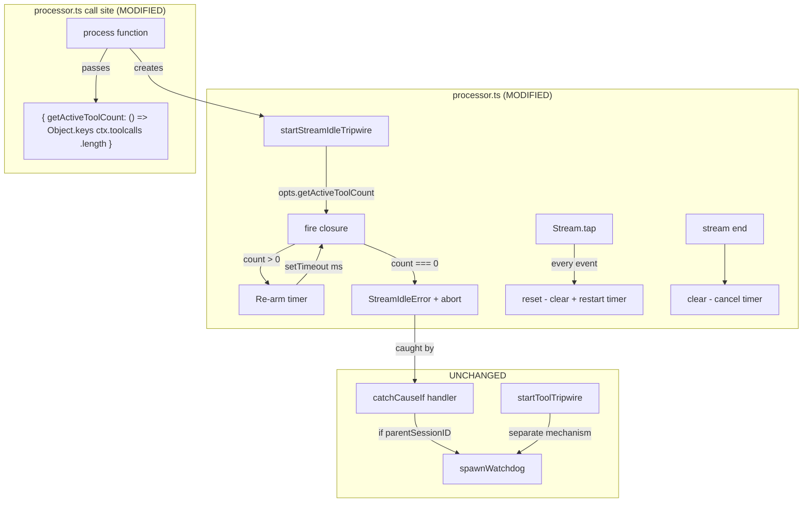

# Design Document: Stream Idle Tripwire Tool-Aware Suppression

## Overview

The stream idle tripwire in `processor.ts` currently fires `StreamIdleError` unconditionally when no AI SDK stream events arrive within the `stream_idle` timeout. This change adds a tool-awareness check to the `fire()` closure: if tools are in-flight (entries present in `ctx.toolcalls`), the timer re-arms instead of aborting.

**Tech stack**: TypeScript, Bun 1.3.12, Effect-TS, Vercel AI SDK v6 (`ai@6.0.158`)

> **AI SDK version note**: This project uses AI SDK v6, where `maxSteps` was replaced by `stopWhen: stepCountIs(1)` (the default). Each `streamText()` call is effectively one step. The stream goes silent between `tool-call` and `tool-result` events because `tool-result` only emits after `tool.execute()` resolves.
>
> **Current state**: `fire()` checks only `if (fired) return` before aborting.  
> **Target state**: `fire()` checks `if (fired) return`, then checks the in-flight tool count via `getActiveToolCount()`. If count > 0, re-arms. If count === 0, fires.

### Key Design Decisions

1. **Options object over positional parameter**: The getter is passed as `opts?: { getActiveToolCount?: () => number }` rather than a third positional arg. This is more extensible and self-documenting at the call site.
2. **Getter function over record reference**: A `() => number` getter is used instead of passing the `ctx.toolcalls` record directly. This keeps the tripwire function decoupled from the `ProcessorContext` type and avoids exposing internal structures.
3. **Same re-arm interval**: The re-arm uses the same `ms` interval as the original timer. Once tools complete, the AI SDK immediately emits `tool-result`, triggering `reset()`. A shorter re-arm interval adds complexity for no practical benefit.
4. **No logging on re-arm**: Re-arm events are not logged. The tripwire is a hot path (fires at most once per `stream_idle` interval per session). Debug observability can be added later if needed.

## Architecture



## Components and Interfaces

### 1. startStreamIdleTripwire (MODIFIED)

**Purpose**: Creates a timer-based tripwire that fires `StreamIdleError` when the AI SDK stream goes silent. Now optionally checks in-flight tool count before firing.

**Interface**:

```typescript
interface StreamIdleTripwireOptions {
  getActiveToolCount?: () => number
}

export function startStreamIdleTripwire(
  ms: number,
  sessionID: string,
  opts?: StreamIdleTripwireOptions,
): {
  signal: AbortSignal
  reset(): void
  clear(): void
  readonly fired: boolean
}
```

**Behavior of `fire()` closure (changed)**:

```typescript
function fire() {
  if (fired) return
  if (opts?.getActiveToolCount && opts.getActiveToolCount() > 0) {
    timer = setTimeout(fire, ms)
    return
  }
  fired = true
  controller.abort(new (StreamIdleError as any)({ sessionID, timeout: ms }))
}
```

**Behavior of `reset()`, `clear()`, `fired` (unchanged)**: Identical to current implementation.

### 2. Process function call site (MODIFIED)

**Purpose**: Passes the in-flight tool count getter when creating the tripwire.

**Current** (processor.ts:586):

```typescript
const idle = streamInput.parentSessionID ? startStreamIdleTripwire(idleMs, ctx.sessionID) : undefined
```

**Target**:

```typescript
const idle = streamInput.parentSessionID
  ? startStreamIdleTripwire(idleMs, ctx.sessionID, {
      getActiveToolCount: () => Object.keys(ctx.toolcalls).length,
    })
  : undefined
```

### 3. Test file (MODIFIED)

**Purpose**: Add tests for tool-aware suppression and fix stale assertion.

**New test cases** (added to existing `describe("stream idle tripwire")` block):

| Test Name                                        | Setup                                             | Assertion                                                         |
| ------------------------------------------------ | ------------------------------------------------- | ----------------------------------------------------------------- |
| suppresses firing when tools are in-flight       | `getActiveToolCount` returns 1; wait past timeout | `fired === false`, `signal.aborted === false`                     |
| fires after tools complete                       | count starts at 1, transitions to 0               | `fired === true` after second interval                            |
| re-arms multiple times while tools in-flight     | count stays at 2 for 4 cycles                     | `fired === false` through all cycles; fires when count drops to 0 |
| clear works during tool-suppressed state         | count is 3; wait; clear                           | `signal.aborted === false` even after additional wait             |
| fires normally when getActiveToolCount returns 0 | count always 0                                    | `fired === true` after timeout (same as no-options)               |

**Stale assertion fix**: `WATCHDOG_TIMEOUT_DEFAULTS.stream_idle` expectation changed from `120` to `300`.

## Data Flow

1. `process()` is called with `streamInput` containing `parentSessionID` (child session).
2. **Timer creation**: `startStreamIdleTripwire(idleMs, ctx.sessionID, { getActiveToolCount })` creates timer. `setTimeout(fire, ms)` starts.
3. **Stream events arrive**: Each event triggers `Stream.tap` → `idle.reset()` → timer cleared and restarted.
4. **Tool call begins**: AI SDK emits `tool-input-start` → entry added to `ctx.toolcalls` (processor.ts:290). No more stream events until tool completes.
5. **Timer expires (tools in-flight)**: `fire()` called → `getActiveToolCount()` returns > 0 → `setTimeout(fire, ms)` re-arms. No abort.
6. **Tool completes**: `settleToolCall` removes entry from `ctx.toolcalls` (processor.ts:165). AI SDK emits `tool-result` → `Stream.tap` → `idle.reset()` → timer restarted normally.
7. **Timer expires (no tools)**: `fire()` called → `getActiveToolCount()` returns 0 → `fired = true` → `controller.abort(StreamIdleError)`.
8. **Catch handler**: `catchCauseIf` catches the error → if `parentSessionID` exists, `spawnWatchdog()` is called.

## File Structure

### New Files

_None._

### Modified Files

| Path                                                | Changes                                                                                                                                             |
| --------------------------------------------------- | --------------------------------------------------------------------------------------------------------------------------------------------------- |
| `packages/opencode/src/session/processor.ts`        | Add optional `opts` parameter to `startStreamIdleTripwire`. Add tool-count check in `fire()`. Update call site to pass `getActiveToolCount` getter. |
| `packages/opencode/test/watchdog/tripwires.test.ts` | Add 5 new test cases for tool-aware suppression. Fix stale `stream_idle` assertion (120 → 300).                                                     |

## Error Handling

No new error paths. The existing `StreamIdleError` → `catchCauseIf` → `spawnWatchdog` pipeline is unchanged. The only change is that `StreamIdleError` is now suppressed (via re-arm) when tools are in-flight.

## Testing Strategy

**Framework**: `bun:test` (existing project convention)  
**Test location**: `packages/opencode/test/watchdog/tripwires.test.ts`  
**Run command**: `bun test test/watchdog/tripwires.test.ts` (from `packages/opencode`)

**Unit tests** (5 new, added to existing `describe("stream idle tripwire")` block):

- Each test creates a `startStreamIdleTripwire` with a mutable `toolCount` variable and passes `{ getActiveToolCount: () => toolCount }`.
- Tests use short timeouts (30-80ms) and `setTimeout`-based waits for fast execution.
- Tests verify `fired`, `signal.aborted`, and timing behavior.

**Existing tests** (5 unchanged):

- Continue to call `startStreamIdleTripwire(ms, sessionID)` without options.
- Exercise the unconditional-fire path, validating backward compatibility.

**Stale assertion fix** (1 change):

- `WATCHDOG_TIMEOUT_DEFAULTS.stream_idle` assertion: `120` → `300`.

**Known limitation**: The test file has a pre-existing circular dependency issue (`app-runtime.ts:67 ReferenceError: Cannot access 'defaultLayer' before initialization`). This affects test execution but is unrelated to our changes. The tests are written correctly and will pass once the circular dep is resolved separately.

**Typecheck**: `bun typecheck` from `packages/opencode` must pass with 0 errors in `processor.ts` and `tripwires.test.ts`.

## Correctness Properties

### Acceptance Criteria Analysis

1.1. WHILE the in-flight tool count is greater than zero WHEN the stream idle timer expires THE SYSTEM SHALL re-arm the timer for another `stream_idle` interval without firing `StreamIdleError`.
Testable: yes -- property
Reasoning: Universal over all timer expirations when tool count > 0. For any positive tool count, the timer must re-arm.

1.2. WHILE the in-flight tool count is zero WHEN the stream idle timer expires THE SYSTEM SHALL fire `StreamIdleError` and abort the stream via `controller.abort()`.
Testable: yes -- property
Reasoning: Universal over all timer expirations when tool count === 0 and fired === false.

1.3. WHILE tools are in-flight THE SYSTEM SHALL re-arm the timer on each expiration, with no upper limit on the number of consecutive re-arms.
Testable: yes -- property
Reasoning: For any N consecutive expirations with positive tool count, no abort occurs.

1.4. THE SYSTEM SHALL use the same `stream_idle` interval for re-arm timers as for the initial timer.
Testable: yes -- example
Reasoning: Specific value check (re-arm interval === initial interval). Not a universal property.

1.5. THE SYSTEM SHALL NOT set the `fired` flag to `true` during a re-arm.
Testable: yes -- property
Reasoning: Universal invariant: after any re-arm, `fired === false`.

2.1. THE SYSTEM SHALL accept an optional third parameter of type `{ getActiveToolCount?: () => number }` on `startStreamIdleTripwire`.
Testable: yes -- example
Reasoning: Type signature check. Not a universal property.

2.2. WHEN the options parameter is omitted THE SYSTEM SHALL fire unconditionally on timeout, identical to the current behavior.
Testable: yes -- property
Reasoning: For any timeout expiration without options, behavior is identical to the pre-change implementation.

2.3. WHILE `getActiveToolCount` is provided WHEN the stream idle timer expires with `getActiveToolCount` returning zero THE SYSTEM SHALL fire `StreamIdleError`.
Testable: yes -- property (redundant with 1.2)
Reasoning: Covered by 1.2 -- zero tool count with options present is the same as zero tool count.

2.4. THE SYSTEM SHALL call `getActiveToolCount` at most once per timer expiration.
Testable: yes -- example
Reasoning: Implementation detail verifiable by counting calls. Not a universal property.

2.5. THE SYSTEM SHALL pass `{ getActiveToolCount: () => Object.keys(ctx.toolcalls).length }` at the call site in `processor.ts`.
Testable: yes -- example
Reasoning: Specific call-site wiring. Not a universal property.

3.1. THE SYSTEM SHALL skip the tripwire entirely for root sessions (where `streamInput.parentSessionID` is falsy).
Testable: yes -- example
Reasoning: Existing behavior, unchanged. Not a new property.

3.2. WHEN `reset()` is called THE SYSTEM SHALL clear and restart the timer, including during a re-arm cycle.
Testable: yes -- property
Reasoning: Universal: reset() always clears and restarts regardless of re-arm state.

3.3. WHEN `clear()` is called THE SYSTEM SHALL cancel the timer and prevent future firing.
Testable: yes -- property
Reasoning: Universal: clear() always prevents future firing regardless of state.

3.4. WHILE `parentSessionID` exists WHEN `StreamIdleError` fires THE SYSTEM SHALL spawn a watchdog agent via `spawnWatchdog`.
Testable: yes -- example (existing tests)
Reasoning: Verified by existing tests passing without modification.

3.5. THE SYSTEM SHALL NOT modify `startToolTripwire`, `spawnWatchdog`, the watchdog agent, or watchdog tools.
Testable: yes -- example (existing tests)
Reasoning: Verified by existing tests passing without modification.

3.6. THE SYSTEM SHALL NOT modify the `stream_idle` default value (300 seconds).
Testable: yes -- example (existing tests)
Reasoning: Verified by existing tests passing without modification.

3.7. THE SYSTEM SHALL NOT modify the task tool deadline mechanism in `task.ts`.
Testable: yes -- example (existing tests)
Reasoning: Verified by existing behavior. No changes to task.ts.

4.1. IF the in-flight tool count transitions from greater than zero to zero before the timer fires THE SYSTEM SHALL fire `StreamIdleError` on the next timer expiration.
Testable: yes -- example
Reasoning: Specific state transition ordering. Timing-dependent scenario.

4.2. IF the timer fires while the in-flight tool count is greater than zero THE SYSTEM SHALL re-arm the timer.
Testable: yes -- property (covered by Property 1)
Reasoning: Subset of Property 1 — any expiration with positive tool count triggers re-arm.

4.3. IF `clear()` is called during a re-arm cycle THE SYSTEM SHALL cancel the re-armed timer and prevent future firing.
Testable: yes -- property (subset of 3.3)
Reasoning: Covered by 3.3 -- clear() universally prevents firing.

5.1-5.7. Test coverage requirements.
Testable: yes -- example (test existence checks)
Reasoning: Meta-requirements about test presence. These are verified by inspecting the test file for the named test cases. No universal property applies — these are structural assertions about the test suite, not behavioral invariants of the system under test.

> **Note on Requirement Group 5**: These are meta-requirements specifying which tests must exist. They are inherently example-based (test presence checks) and do not describe system behavior that can be expressed as a universal property. Each is validated by the existence and correctness of the corresponding test case in the test file.

### Properties

**Property 1: Tool Suppression Invariant**
_For any_ timer expiration where `getActiveToolCount()` returns a value greater than zero, the tripwire re-arms without setting `fired` to `true` and without calling `controller.abort()`.
**Validates: Requirements 1.1, 1.3, 1.5, 4.2**

**Property 2: Zero-Tool Fire Guarantee**
_For any_ timer expiration where `getActiveToolCount()` returns zero (or is undefined) and `fired` is `false`, the tripwire sets `fired` to `true` and calls `controller.abort()` with a `StreamIdleError`.
**Validates: Requirements 1.2, 2.2, 2.3**

**Property 3: Clear Finality**
_For any_ state of the tripwire (initial, re-armed, or post-fire), calling `clear()` prevents all future `controller.abort()` calls.
**Validates: Requirements 3.3, 4.3**

**Property 4: Reset Consistency**
_For any_ state of the tripwire where `fired` is `false` (initial or re-armed), calling `reset()` clears the current timer and starts a new one with the same interval `ms`.
**Validates: Requirements 3.2**

**Property 5: Backward Compatibility**
_For any_ invocation of `startStreamIdleTripwire(ms, sessionID)` without the third parameter, the behavior is identical to the pre-change implementation: the timer fires unconditionally after `ms` with no tool-count check.
**Validates: Requirements 2.2, 3.4, 3.5, 3.6, 3.7**
