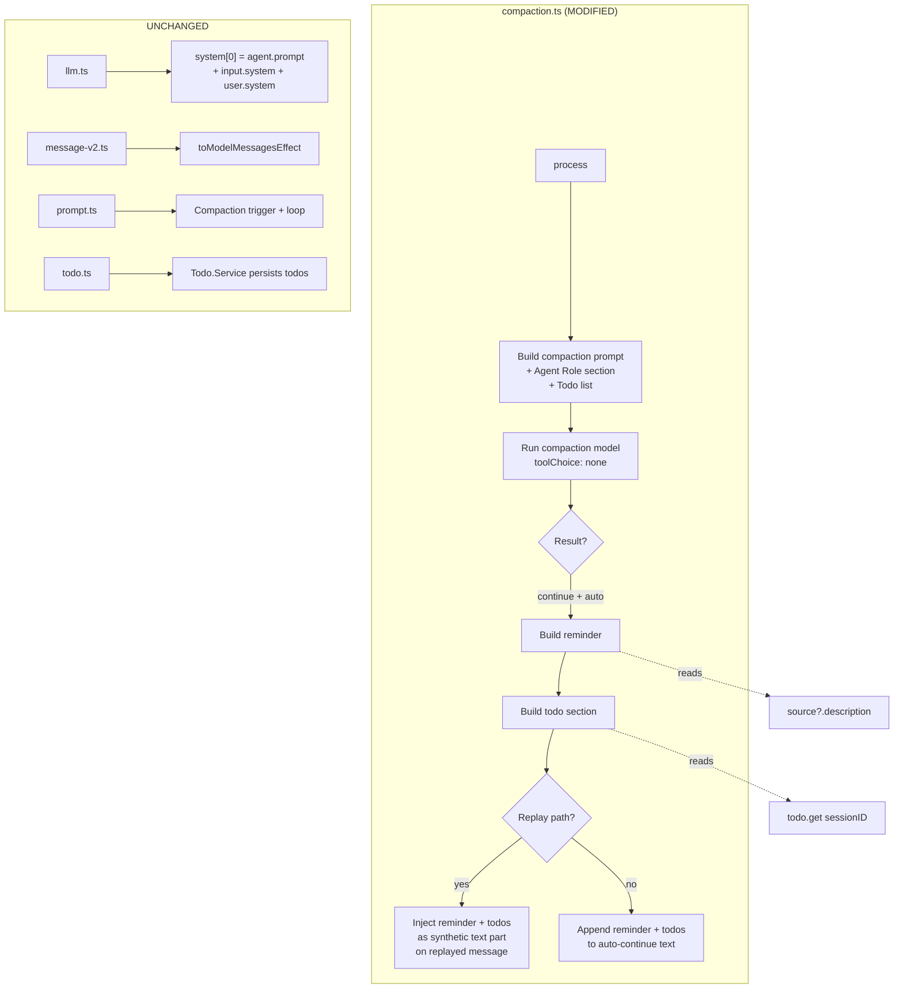

# Design Document: Compaction Identity Preservation & Structured State Survival

## Overview

This design modifies `compaction.ts` to strengthen post-compaction identity reinforcement and inject todo state into the auto-continue message. The changes are minimal — a single file is modified (`compaction.ts`) with two logical changes that map cleanly to two feature branches.

**Current state**: After compaction, the auto-continue user message contains a generic `<system-reminder>` tag with the agent name and a fixed instruction. Todo state is only in the compaction prompt (what the compaction model sees), not in the post-compaction context.

**Target state**: After compaction, the auto-continue user message contains a detailed identity reinforcement block (agent name, role description from `description` field, behavioral constraints) and the current todo list in markdown format.

### Key Design Decisions

1. **Single injection point — auto-continue user message**: Identity reinforcement and todo state are both injected into the auto-continue message text. This preserves the Anthropic prompt cache (no changes to `system[0]`) and avoids mid-conversation system messages (unreliable across providers). The existing `reminder` variable and injection points (replay path line 362-372, standard path line 418) are reused.

2. **Reuse existing `formatTodos()`**: The todo injection uses the same `formatTodos()` function that already formats todos for the compaction prompt. No new formatting logic is needed.

3. **`description` field with fallback**: The identity reinforcement uses the agent's `description` field for a concise role summary. When `description` is absent or empty, a generic fallback is used. The full system prompt (which can be 400+ lines) is NOT re-injected — it's already in `system[0]`.

4. **No schema changes**: No new part types, no changes to `CompactionPart`, `TextPart`, or the `Part` union. The injection uses existing text parts with existing metadata.

## Architecture



## Components and Interfaces

### 1. buildIdentityReinforcement (NEW helper function)

**Purpose**: Construct the identity reinforcement text block from the source agent definition.

```typescript
function buildIdentityReinforcement(agentName: string, source: Agent.Info | undefined): string | undefined
```

**Behavior**:

- Returns `undefined` if `source` is `undefined`, `source.prompt` is falsy, or `source.native` is `true`
- Extracts `source.description` as the role description; falls back to `"a specialized agent"` if absent or empty
- Returns an XML-tagged block:
  ```
  <system-reminder>
  You are the "{agentName}" agent.
  Role: {description}
  Your role and constraints from your system prompt still apply after this compaction.
  Continue performing your designated role. Do not switch to code implementation or deviate from your assigned responsibilities.
  </system-reminder>
  ```

### 2. buildPostCompactionContext (NEW helper function)

**Purpose**: Combine identity reinforcement and todo state into the post-compaction context block appended to the auto-continue message.

```typescript
function buildPostCompactionContext(reminder: string | undefined, todos: Todo.Info[]): string | undefined
```

**Behavior**:

- Calls `formatTodos(todos)` to get the todo markdown section (or `undefined` if empty)
- Combines `reminder` and `todoSection` with `\n\n` separators
- Returns `undefined` if both are absent
- Returns the combined block if either is present

### 3. Modified `process` function

**Purpose**: The existing `process` function in `SessionCompaction` is modified at two points.

**Change A — Reminder construction (line 332-335)**:
Replace the current inline ternary with a call to `buildIdentityReinforcement(userMessage.agent, source)`.

**Change B — Post-compaction context (line 362-372 and line 418)**:
Replace the current `reminder` usage with `buildPostCompactionContext(reminder, todos)` where `todos` is the value already fetched at line 228.

**Interface**: No changes to the `SessionCompaction.Interface` — `process` retains its existing signature:

```typescript
readonly process: (input: {
  parentID: MessageID
  messages: MessageV2.WithParts[]
  sessionID: SessionID
  auto: boolean
  overflow?: boolean
}) => Effect.Effect<"continue" | "stop">
```

## Data Flow

### Happy Path: Custom Agent with Todos

1. `prompt.ts:1603` triggers compaction via `compaction.process()`
2. `compaction.ts:228` — `todos` fetched from `Todo.Service`
3. `compaction.ts:229-231` — `formatTodos(todos)` appended to compaction prompt (existing behavior, unchanged)
4. `compaction.ts:236` — `source` resolved via `agents.get(userMessage.agent)` — returns agent with `native: false`, `prompt` set, `description` set
5. `compaction.ts:252-316` — compaction model runs, produces summary
6. `compaction.ts:332` — `buildIdentityReinforcement(userMessage.agent, source)` called — returns reinforcement text with agent name + description
7. `compaction.ts:~335` — `buildPostCompactionContext(reminder, todos)` called — returns combined block with identity + todo section
8. **Standard path** (line 418): `postContext` appended to auto-continue text: `text + "\n\n" + postContext`
9. **Replay path** (line 362-372): `postContext` injected as synthetic text part on replayed message

### Degradation Path: Missing Agent

Steps 1-5 same. At step 6, `source` is `undefined` → `buildIdentityReinforcement` returns `undefined`. At step 7, `buildPostCompactionContext(undefined, todos)` returns only the todo section (if todos exist). Todo injection still works; identity reinforcement is silently skipped.

### Degradation Path: Native Agent, No Todos

Steps 1-5 same. At step 6, `source.native` is `true` → `buildIdentityReinforcement` returns `undefined`. At step 7, `todos` is empty → `formatTodos` returns `undefined`. `buildPostCompactionContext(undefined, [])` returns `undefined`. No post-compaction context is appended — existing behavior for native agents preserved.

## File Structure

### New Files

None.

### Modified Files

| Path                                                     | Changes                                                                                                                                                                                        |
| -------------------------------------------------------- | ---------------------------------------------------------------------------------------------------------------------------------------------------------------------------------------------- |
| `packages/opencode/src/session/compaction.ts`            | Add `buildIdentityReinforcement()` and `buildPostCompactionContext()` helper functions. Modify `process()` to use them for reminder construction (line ~332) and injection (lines ~362, ~418). |
| `packages/opencode/test/session/compaction.test.ts`      | Add tests for strengthened identity reinforcement (description field usage, fallback, both injection paths).                                                                                   |
| `packages/opencode/test/session/compaction-todo.test.ts` | Add tests for post-compaction todo injection (present in auto-continue text, omitted when empty).                                                                                              |

## Error Handling

| Failure Mode                                        | Handling                                                                                                                                                                                                                                                                                |
| --------------------------------------------------- | --------------------------------------------------------------------------------------------------------------------------------------------------------------------------------------------------------------------------------------------------------------------------------------- |
| `agents.get(userMessage.agent)` returns `undefined` | `buildIdentityReinforcement` returns `undefined` — identity reinforcement silently skipped, compaction completes normally                                                                                                                                                               |
| `source.description` is `undefined` or `""`         | Fallback to generic `"a specialized agent"` text                                                                                                                                                                                                                                        |
| `todo.get(sessionID)` returns empty array           | `formatTodos` returns `undefined` — todo section omitted from post-compaction context                                                                                                                                                                                                   |
| Double compaction (overflow after compaction)       | Second compaction sees the first's auto-continue message (with reinforcement + todos) as part of conversation history. The compaction model summarizes it. The second auto-continue message gets fresh reinforcement + fresh todos from the database. No accumulation or contradiction. |

## Testing Strategy

### Unit Tests — `buildIdentityReinforcement`

Pure function, no Effect dependencies. Test with `test()` (no tmpdir/Effect setup needed).

| Test                             | Input                                                                               | Expected                                                        |
| -------------------------------- | ----------------------------------------------------------------------------------- | --------------------------------------------------------------- |
| Custom agent with description    | `source = { prompt: "...", native: false, description: "Conversational agent..." }` | Returns `<system-reminder>` with description text               |
| Custom agent without description | `source = { prompt: "...", native: false }`                                         | Returns `<system-reminder>` with "a specialized agent" fallback |
| Native agent                     | `source = { prompt: "...", native: true, description: "..." }`                      | Returns `undefined`                                             |
| Undefined source                 | `source = undefined`                                                                | Returns `undefined`                                             |
| Agent without prompt             | `source = { native: false }`                                                        | Returns `undefined`                                             |

### Unit Tests — `buildPostCompactionContext`

Pure function, no Effect dependencies.

| Test             | Input                                                    | Expected                                  |
| ---------------- | -------------------------------------------------------- | ----------------------------------------- |
| Reminder + todos | `reminder = "<system-reminder>..."`, `todos = [3 items]` | Returns combined block with both sections |
| Reminder only    | `reminder = "<system-reminder>..."`, `todos = []`        | Returns reminder only                     |
| Todos only       | `reminder = undefined`, `todos = [2 items]`              | Returns todo section only                 |
| Neither          | `reminder = undefined`, `todos = []`                     | Returns `undefined`                       |

### Integration Tests — Post-Compaction Context in Auto-Continue Message

Follow existing `process` test pattern: `test()` + `await using tmp` + `Instance.provide` + `ManagedRuntime`.

| Test                                            | Setup                                           | Assertion                                                                             |
| ----------------------------------------------- | ----------------------------------------------- | ------------------------------------------------------------------------------------- |
| Identity reinforcement appears in auto-continue | Agent with `description` field, `native: false` | Last user message text contains `<system-reminder>` with agent name and description   |
| Todo list appears in auto-continue              | Session with 2 todo items                       | Last user message text contains `"## Current Task List"` with todo entries            |
| Both identity and todos in auto-continue        | Agent with description + session with todos     | Last user message text contains both `<system-reminder>` and `"## Current Task List"` |
| Native agent: no identity reinforcement         | Agent with `native: true`                       | Last user message text does not contain `<system-reminder>`                           |
| Empty todos: no todo section                    | Session with zero todo items                    | Last user message text does not contain `"## Current Task List"`                      |
| Description fallback                            | Agent with no `description`, `native: false`    | `<system-reminder>` contains "a specialized agent"                                    |

### Existing Tests — Regression

All 11 existing tests in `compaction.test.ts` `describe("session.compaction.process")` must continue to pass. The 9 existing tests in `compaction-todo.test.ts` must continue to pass.

## Correctness Properties

### Acceptance Criteria Analysis

1.1 WHEN compaction completes for custom agent → identity reinforcement in auto-continue
Testable: yes — property
Reasoning: Universal over all custom agents — for any agent with `prompt && !native`, the output must contain reinforcement.

1.2 WHEN agent has non-empty `description` → use description in reinforcement
Testable: yes — property
Reasoning: For any agent with a non-empty description string, that string must appear in the output.

1.3 WHEN agent has absent/empty `description` → generic fallback
Testable: yes — property
Reasoning: For any agent with absent/empty description, the output contains the fallback text.

1.4 WHEN replay path → inject as synthetic part
Testable: yes — example
Reasoning: Specific to the replay code path — needs integration test, not a universal property.

1.5 WHEN standard path → append to text
Testable: yes — example
Reasoning: Specific to the standard code path.

1.6 WHEN native agent → omit reinforcement
Testable: yes — property
Reasoning: Universal over all native agents.

2.1 WHEN auto-continue enabled → inject todo list
Testable: yes — property
Reasoning: For any non-empty todo list, the output must contain the formatted todos.

2.2 WHEN session has todos → include content, status, priority
Testable: yes — property
Reasoning: For any todo item, all three fields must be present.

2.3 WHEN zero todos → omit todo section
Testable: yes — property
Reasoning: Universal — empty input always produces no todo section.

2.4 THE SYSTEM SHALL continue to include todos in compaction prompt
Testable: yes — example
Reasoning: Specific behavior in existing code — regression test.

2.5 WHEN replay path → inject todos as synthetic part
Testable: yes — example
Reasoning: Specific code path.

2.6 WHEN standard path → append todos to text
Testable: yes — example
Reasoning: Specific code path.

3.1 THE SYSTEM SHALL preserve system[0] content
Testable: yes — property
Reasoning: Universal invariant — for any compaction event, the identity reinforcement and todo injection produce only conversation-message content, never system-prompt content.

3.2 THE SYSTEM SHALL inject only into conversation messages
Testable: yes — property
Reasoning: Implied by 3.1 — the helper functions return plain strings for user-message injection, never modify input.system or agent.prompt.

3.3 THE SYSTEM SHALL NOT add mid-conversation system messages
Testable: yes — example
Reasoning: Verified by inspecting the output message types.

4.1 IF source undefined → skip without error
Testable: yes — property
Reasoning: For any undefined source, the function returns undefined and no error is thrown.

4.2 IF no prompt → skip without error
Testable: yes — property
Reasoning: For any source without prompt, same behavior.

4.3 IF native → skip
Testable: redundant with 1.6
Reasoning: Same property as 1.6.

4.4 IF double compaction → valid state
Testable: yes — example
Reasoning: Requires sequential compaction integration test — not a simple input-output property.

4.5 WHILE multiple compactions → self-contained reinforcement
Testable: yes — property
Reasoning: Each reinforcement output is deterministic from its inputs — no hidden state accumulation.

5.1-5.6 Backward compatibility criteria (schema, metadata, hooks, flow, text, filter)
Testable: yes — property (schema invariant) + example (regression tests)
Reasoning: The schema invariant (CompactionPart shape, TextPart.metadata behavior) is a universal property. The specific hook firing points and flow structure are verified by regression tests.

5.7 WHEN all existing tests run → pass without modification
Testable: yes — example (regression tests)
Reasoning: Verified by running existing test suite.

6.1-6.4 Branch delivery criteria
Testable: no (process constraint, not code behavior)
Reasoning: Verified by git log inspection, not by automated tests.

### Properties

**Property 1: Custom Agent Reinforcement Completeness**
_For any_ agent info where `prompt` is truthy and `native` is `false`, `buildIdentityReinforcement(name, info)` returns a string containing the agent name.
**Validates: Requirements 1.1**

**Property 2: Description Fidelity**
_For any_ agent info where `description` is a non-empty string, `buildIdentityReinforcement(name, info)` returns a string containing the exact `description` value.
**Validates: Requirements 1.2**

**Property 3: Fallback Consistency**
_For any_ agent info where `description` is `undefined` or `""`, `buildIdentityReinforcement(name, info)` returns a string containing the fallback text "a specialized agent".
**Validates: Requirements 1.3**

**Property 4: Native Agent Exclusion**
_For any_ agent info where `native` is `true`, `buildIdentityReinforcement(name, info)` returns `undefined`.
**Validates: Requirements 1.6, 4.3**

**Property 5: Undefined Source Safety**
_For any_ `undefined` source, `buildIdentityReinforcement(name, undefined)` returns `undefined` without throwing.
**Validates: Requirements 4.1**

**Property 6: Todo Injection Completeness**
_For each_ todo item in a non-empty list, `formatTodos(todos)` returns a string containing the item's `content`, `status`, and `priority` values.
**Validates: Requirements 2.2**

**Property 7: Empty Todo Omission**
_For any_ empty todo list, `formatTodos([])` returns `undefined`.
**Validates: Requirements 2.3**

**Property 8: Context Composition Idempotence**
_For any_ combination of `reminder` (string | undefined) and `todos` (Todo.Info[]), calling `buildPostCompactionContext(reminder, todos)` multiple times with the same inputs produces the same output.
**Validates: Requirements 4.5**

**Property 9: Self-Containment**
_For any_ `reminder` string and any `todos` array, the output of `buildPostCompactionContext(reminder, todos)` depends only on those two inputs — it reads no external state and produces no side effects.
**Validates: Requirements 4.5**

**Property 10: Cache Anchor Preservation**
_For any_ compaction event, `buildIdentityReinforcement` and `buildPostCompactionContext` return plain strings (or `undefined`) intended for user-message injection — neither function modifies `input.system`, `agent.prompt`, or any value that contributes to `system[0]`.
**Validates: Requirements 3.1, 3.2**

**Property 11: Schema Backward Compatibility**
_For any_ compaction event, the output messages produced by the modified `process` function use only existing part types (`TextPart`, `CompactionPart`) with their existing schemas — no new part types are introduced and no existing schema fields are removed or retyped.
**Validates: Requirements 5.1, 5.2, 5.3, 5.4, 5.6**
