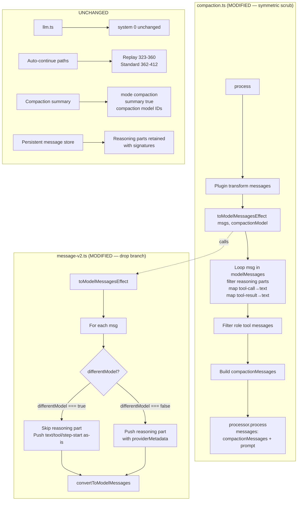

# Design Document: Compaction Strips Reasoning Signatures When Models Differ

## Overview

This design specifies the minimal correct fix for the compaction-time reasoning-signature strip bug. Two surgical edits, both inside the existing OpenCode session code, applied to two adjacent functions:

1. **Conversion-site fix** at `packages/opencode/src/session/message-v2.ts:790-796` — change the reasoning emit branch so that when `differentModel === true`, no reasoning part is pushed at all (drop instead of strip-and-keep-text).
2. **Symmetric preventive scrub** at `packages/opencode/src/session/compaction.ts:240-254` (loop body; closing brace at `:255`) — extend the existing post-conversion loop to filter out `type: "reasoning"` content parts from each `ModelMessage.content` array.

**Current state**: When the configured `compaction` agent uses a model that differs from the working agent's model (the documented cost-saving setup, e.g. Haiku summarizing Sonnet), the conversion path emits reasoning content parts with `text` preserved but with `providerMetadata` (carrying the Anthropic `signature`) dropped. Anthropic's API rejects the resulting messages array with `messages.N.content.M.thinking.signature: Field required`.

**Target state**: When `differentModel === true`, the entire reasoning part is dropped from the conversion output. No signature-less thinking block is ever produced. The compaction-side scrub provides defense-in-depth against future plugin-ordering changes that could otherwise re-introduce the bypass.

**Verification**: The bug is reproducible without any LLM call. Hard evidence is captured at `specs/2026-04-27-compaction-thinking-signature/experiment/reasoning-signature-strip.test.ts` and `RESULTS.md` — executed 2026-04-27 against `local/compaction-agent-identity@49700133b6`, 2 pass / 0 fail / 8 expect calls. The captured `ModelMessage[]` output for both branches proves the strip empirically.

### Key Design Decisions

1. **Drop reasoning entirely, do not flatten to text**: Per goal Q2, when reasoning crosses a model boundary, it is dropped rather than flattened to a textual placeholder. Reasoning prose is internal scratch work that the compaction summary template (`compaction.ts:191-223`) does not reference; flattening risks the compaction model treating reasoning as factual claims; reasoning prose can be thousands of tokens and would inflate the compaction context. This is a one-way loss accepted as part of the fix.

2. **Apply at the conversion site, not at the compaction call site only**: The `differentModel` branch at `message-v2.ts:790-796` is the structural strip site. Fixing only the compaction loop (`compaction.ts:240-254`) would leave a half-state in the conversion output (text without signature) that any future caller could trip over. Fixing at the conversion site makes the invariant local to one function: `toModelMessagesEffect` never emits a reasoning part without its signature.

3. **Symmetric scrub is defense-in-depth, not load-bearing**: Per goal Logic-L3, under the current ordering (`plugin.trigger("experimental.chat.messages.transform")` at `compaction.ts:235` runs BEFORE `MessageV2.toModelMessagesEffect` at `compaction.ts:236`), no reasoning part can survive the message-v2 drop to reach the compaction loop. The compaction-side scrub costs effectively nothing, mirrors the existing tool-call/tool-result pattern (the same loop already does an analogous structural scrub for those types), and future-proofs against ordering changes. Both changes ship together because they form a coherent "structured part type that cannot safely cross the compaction boundary" treatment.

4. **No new helper function**: Unlike the sibling `buildIdentityReinforcement` (extracted into a pure helper), the reasoning fix is a one-line conditional inversion at `message-v2.ts:790-796` and a 4-line filter step at `compaction.ts:240-254`. Both are too small to extract into named helpers; doing so would obscure the change, not clarify it.

5. **Apply uniformly across all three call sites of `toModelMessagesEffect`**: The line at `message-v2.ts:790-796` is shared by compaction (`compaction.ts:236`), the standard agent turn (near `prompt.ts:1477`), and title generation (near `prompt.ts:188`). Per goal Q1, the compaction case alone justifies the change; the other two call sites are incidentally improved (mid-session model switch, title-generation small-model rejection). No call-site-specific branching is added.

6. **No schema changes, no public-API changes, no new modules**: The fix is internal to the conversion + compaction wiring. The diff is reviewable as ~5 changed lines plus tests.

## Architecture



## Components and Interfaces

### 1. Modified `toModelMessagesEffect` reasoning branch (`message-v2.ts:790-796`)

**Purpose**: Emit reasoning content parts to the resulting `UIMessage.parts` array only when the call's model matches the assistant message's recorded model.

**Current code** (lines 790-796):

```typescript
if (part.type === "reasoning") {
  assistantMessage.parts.push({
    type: "reasoning",
    text: part.text,
    ...(differentModel ? {} : { providerMetadata: part.metadata }),
  })
}
```

**Target code**:

```typescript
if (part.type === "reasoning" && !differentModel) {
  assistantMessage.parts.push({
    type: "reasoning",
    text: part.text,
    providerMetadata: part.metadata,
  })
}
```

**Behavior**:

- When `part.type === "reasoning"` AND `differentModel === true`: the entire `if` body is skipped — no part is pushed.
- When `part.type === "reasoning"` AND `differentModel === false`: the part is pushed with `providerMetadata: part.metadata`. The conditional spread is removed because the branch is now only entered when `differentModel === false`.
- When `part.type !== "reasoning"`: branch is not entered (existing behavior).

**Interface**: No change to the public `toModelMessages` / `toModelMessagesEffect` exports. The signature remains:

```typescript
toModelMessagesEffect(
  input: WithParts[],
  model: Provider.Model,
  options?: { stripMedia?: boolean },
): Effect.Effect<ModelMessage[], never, never>
```

**Downstream effect**:

- The two downstream safety nets continue to work as today: the length check at `message-v2.ts:798` (`if (assistantMessage.parts.length > 0) result.push(assistantMessage)`) suppresses fully-empty assistants; the post-loop filter at `:825-833` (`result.filter((msg) => msg.parts.some((part) => part.type !== "step-start"))`) suppresses assistants whose only surviving part is a `step-start`.

### 2. Modified `process` post-conversion loop (`compaction.ts:240-254`)

**Purpose**: Filter out reasoning content parts from each `ModelMessage.content` before the messages array is sent to the compaction model. Defense-in-depth alongside the existing tool-call/tool-result transformations.

**Current code** (lines 238-255):

```typescript
// Convert structured tool-call/tool-result parts into plain text so the
// compaction model never sees tool markup and can't hallucinate tool calls.
for (const msg of modelMessages) {
  if (!Array.isArray(msg.content)) continue
  msg.content = msg.content.map((part: any) => {
    if (part.type === "tool-call") {
      const inputStr = typeof part.input === "string" ? part.input : JSON.stringify(part.input)
      const truncatedInput = inputStr.length > 300 ? inputStr.slice(0, 300) + "... [truncated]" : inputStr
      return { type: "text" as const, text: `[Called tool: ${part.toolName}]\n[Input: ${truncatedInput}]` }
    }
    if (part.type === "tool-result") {
      const outputStr = typeof part.output === "string" ? part.output : JSON.stringify(part.output)
      const truncatedOutput = outputStr.length > 500 ? outputStr.slice(0, 500) + "... [truncated]" : outputStr
      return { type: "text" as const, text: `[Tool result: ${part.toolName}]\n${truncatedOutput}` }
    }
    return part
  })
}
```

**Target code**:

```typescript
// Convert structured tool-call/tool-result parts into plain text so the
// compaction model never sees tool markup and can't hallucinate tool calls.
// Filter out reasoning parts entirely — they cannot safely cross a model
// boundary (signatures are model-specific and the Anthropic API rejects
// echoed thinking blocks without their original signature). The conversion
// path at message-v2.ts:790-796 already drops reasoning parts when models
// differ; this filter is defense-in-depth against future plugin-ordering
// changes that could re-introduce the bypass.
for (const msg of modelMessages) {
  if (!Array.isArray(msg.content)) continue
  msg.content = msg.content
    .filter((part: any) => part.type !== "reasoning")
    .map((part: any) => {
      if (part.type === "tool-call") {
        const inputStr = typeof part.input === "string" ? part.input : JSON.stringify(part.input)
        const truncatedInput = inputStr.length > 300 ? inputStr.slice(0, 300) + "... [truncated]" : inputStr
        return { type: "text" as const, text: `[Called tool: ${part.toolName}]\n[Input: ${truncatedInput}]` }
      }
      if (part.type === "tool-result") {
        const outputStr = typeof part.output === "string" ? part.output : JSON.stringify(part.output)
        const truncatedOutput = outputStr.length > 500 ? outputStr.slice(0, 500) + "... [truncated]" : outputStr
        return { type: "text" as const, text: `[Tool result: ${part.toolName}]\n${truncatedOutput}` }
      }
      return part
    })
}
```

**Behavior**:

- For each `ModelMessage` whose `content` is an array, a `.filter()` step is inserted before the existing `.map()`. The filter drops every element where `part.type === "reasoning"`.
- The existing `.map()` for `tool-call` and `tool-result` transformations is unchanged — it now operates on the post-filter sequence. For other part types it is a no-op (returns `part`).
- Empty `content` arrays after the filter are tolerated: the existing `compactionMessages = modelMessages.filter((msg) => msg.role !== "tool")` at line 257 only filters out `role: "tool"` messages; an `assistant` message with empty `content` is left in place. AI SDK call handling tolerates empty `content` on assistant messages (per the goal's Edge Cases — "downstream AI SDK call handling tolerates empty content arrays").

**Interface**: No change to `SessionCompaction.Interface.process`. The `messages` parameter shape passed to `processor.process` (lines 298-304) is unchanged at the type level — only the values are filtered.

### 3. Unchanged surfaces

- `compaction.ts:181-184` (compaction model selection) — unchanged.
- `compaction.ts:191-223` (compaction prompt template) — unchanged. The `## Agent Role & Constraints` template section remains.
- `compaction.ts:225-235` (prompt assembly + plugin trigger) — unchanged.
- `compaction.ts:257` (tool-role filter) — unchanged.
- `compaction.ts:260-285` (compaction summary message construction) — unchanged.
- `compaction.ts:292-307` (`processor.process` call shape) — unchanged in structure.
- `compaction.ts:323-360` (replay path) — unchanged.
- `compaction.ts:362-412` (standard auto-continue path) — unchanged.
- `message-v2.ts:692` (`differentModel` computation) — unchanged.
- `message-v2.ts:710-715` (text branch) — unchanged.
- `message-v2.ts:716-719` (step-start branch) — unchanged.
- `message-v2.ts:720-788` (tool branches) — unchanged.
- `message-v2.ts:798` (length check) — unchanged.
- `message-v2.ts:825-833` (post-loop filter + `convertToModelMessages` call) — unchanged.
- `message-v2.ts:129-140` (`ReasoningPart` schema) — unchanged.
- `llm.ts:99-124` (system prompt construction, `system[0]` header capture at `:113`, cache-preserve check at `:119-124`) — unchanged.
- `prompt.ts` standard agent turn and title generation call sites — unchanged in source.
- All plugin hooks — unchanged.
- The persistent message store (`Session.updatePart` for reasoning parts) — unchanged.
- The OpenCode UI display of reasoning history — unchanged (UI reads from the store, not from `toModelMessages` output).

## Data Flow

### Happy Path: Compaction with Different Model + Reasoning History

1. User triggers compaction (overflow at `prompt.ts:1603`).
2. `compaction.ts:181-184` — compaction agent's `model` resolves to a different `providerID/modelID` than `userMessage.model.providerID/modelID`. **Different-model condition triggered.**
3. `compaction.ts:225` — `prompt` assembled.
4. `compaction.ts:227` — `source` resolved via `agents.get(userMessage.agent)`.
5. `compaction.ts:228-232` — `system[]` populated with truncated agent prompt.
6. `compaction.ts:234-235` — messages structured-cloned and plugin transform fired.
7. `compaction.ts:236` — **`MessageV2.toModelMessagesEffect(msgs, model, { stripMedia: true })`** invoked with the compaction `model`.
   - For each pre-compaction assistant message: `differentModel = true` (their `providerID/modelID` is the working model's).
   - At the `if (part.type === "reasoning" && !differentModel)` guard (post-fix line 790-796): the reasoning part is **skipped**. `assistantMessage.parts` does not receive the reasoning entry.
   - Other parts (text, tool-call, tool-result, step-start) continue through their existing branches with their existing `differentModel ? {} : ...` rules.
   - `convertToModelMessages` at `:825-833` produces a `ModelMessage[]` with no reasoning content parts on those assistant messages.
8. `compaction.ts:240-254` — **post-conversion loop runs**. The new `.filter(part => part.type !== "reasoning")` step is a no-op (no reasoning parts survived step 7). The `.map()` continues to flatten any tool-call/tool-result parts. The loop is preserved as defense-in-depth.
9. `compaction.ts:257` — `compactionMessages = modelMessages.filter((msg) => msg.role !== "tool")`.
10. `compaction.ts:259-286` — fresh `MessageV2.Assistant` summary message constructed with the compaction model's `providerID/modelID` at `:280-281`.
11. `compaction.ts:287-291` — processor created with the compaction model.
12. `compaction.ts:292-307` — `processor.process({ ..., messages: [...compactionMessages, prompt-as-user-message], toolChoice: "none", ... })` invoked. **The `messages` argument now contains zero reasoning content parts on any assistant message.** Anthropic's API accepts the request.
13. Compaction summary streams back as text. Summary message saved with `summary: true` at lines 280-281's compaction model IDs.

### Auto-continue Path After Compaction

1. `prompt.ts` re-enters the LLM loop with the agent's working model.
2. `toModelMessagesEffect` is called with the working model. The compaction summary message (carrying the compaction model's IDs from step 10 above) now triggers `differentModel === true` for the working model.
3. If the compaction summary contains any reasoning parts (some reasoning-capable models emit thinking blocks even with `toolChoice: "none"`), the post-fix branch at `message-v2.ts:790-796` drops them. The summary's text content is unaffected.
4. The agent's next turn proceeds with valid messages. No 400 from Anthropic.

### Degradation Path: Same-Model Compaction (No Trigger)

1. The user has not configured `compaction.model`, OR has set it equal to the working model. `compaction.ts:182-184` resolves `model` to the same `providerID/modelID` as `userMessage.model`.
2. At step 7 above: `differentModel = false` for every prior assistant message. The `if (part.type === "reasoning" && !differentModel)` guard enters the body. Reasoning parts are pushed with `providerMetadata: part.metadata` intact.
3. `convertToModelMessages` produces `ModelMessage[]` with reasoning content parts carrying `providerOptions.anthropic.signature` (the original signature value).
4. Anthropic accepts the request — signatures are valid because they were produced by the same model.
5. **No-op**: this is the existing behavior. The fix has no effect when models match.

### Degradation Path: Reasoning-Only Assistant Message + Step-Start

1. A pre-compaction assistant message has `parts = [step-start, reasoning]` and `differentModel === true`.
2. Loop body in `toModelMessagesEffect`:
   - `step-start` part: pushed normally at lines 716-719. `assistantMessage.parts` becomes `[step-start]`.
   - `reasoning` part: post-fix guard fails (`differentModel === true`), branch skipped.
3. End of loop: `assistantMessage.parts.length === 1`, so the line-798 length check passes — the assistant message is pushed onto `result`.
4. Post-loop filter at `:825-833`: `result.filter((msg) => msg.parts.some((part) => part.type !== "step-start"))`. The assistant message's only part is `step-start`, so the predicate `parts.some(part.type !== "step-start")` returns `false` and the message is filtered out.
5. `convertToModelMessages` receives the filtered list — the reasoning-only assistant has been removed entirely. Output is correct.

This is the case the goal's Logic-L1 finding requires the integration test to exercise. Without the line-825-833 filter, the message would slip through with empty content and reach the LLM.

### Degradation Path: Reasoning-Only Assistant Message Without Step-Start

1. A pre-compaction assistant message has `parts = [reasoning]` (no step-start) and `differentModel === true`.
2. Loop body: only the reasoning branch fires; post-fix guard fails; nothing pushed. `assistantMessage.parts` stays `[]`.
3. End of loop: line-798 length check (`if (assistantMessage.parts.length > 0) result.push(assistantMessage)`) returns `false` — the assistant is not pushed onto `result`.
4. `convertToModelMessages` never sees the empty assistant. Output is correct.

This case is rare in practice (`step-start` is unconditionally pushed at lines 716-719 for any `step-start` source part) but is exercised by the test fixture in Requirement 6.5.

## File Structure

### New Files

None.

### Modified Files

| Path                                                | Changes                                                                                                                                                                                       |
| --------------------------------------------------- | --------------------------------------------------------------------------------------------------------------------------------------------------------------------------------------------- |
| `packages/opencode/src/session/message-v2.ts`       | Modify reasoning branch at `:790-796` — guard with `&& !differentModel` and remove the conditional spread since the branch is now only entered when `differentModel === false`.              |
| `packages/opencode/src/session/compaction.ts`       | Insert a `.filter(part => part.type !== "reasoning")` step before the existing `.map(...)` inside the post-conversion loop (loop body `:240-254`; closing brace at `:255`). Update the comment header. |
| `packages/opencode/test/session/message-v2.test.ts` | Append structural unit tests for the `differentModel === true` reasoning path (fixtures: `[reasoning, text]` different-model, `[reasoning, text]` same-model control, `[step-start, reasoning]` only-step-start-after-drop, `[reasoning]` reasoning-only, `[reasoning, text, tool-call(completed)]` mixed). The existing reasoning fixture at `:671-719` (same-model path) remains and must continue to pass unchanged. |
| `packages/opencode/test/session/compaction.test.ts` | Add fixture-based integration tests for: (a) compaction with reasoning history under different model — assert `processor.process.messages` contains no reasoning parts, (b) same-model control — assert reasoning preserved with signature, and (c) double compaction sequence — assert no reasoning parts in either compaction call. |

### Modified Test File — Reasoning Fixture Coverage

A reasoning-part fixture already exists at `packages/opencode/test/session/message-v2.test.ts:671-719`. The existing test (`"includes aborted assistant messages only when they have non-step-start/reasoning content"`) constructs assistant messages with `type: "reasoning"` parts and exercises only the **`differentModel === false` (same-model) path** — its assertion at lines 711-719 expects `{ type: "reasoning", text: "thinking", providerOptions: undefined }`, where `providerOptions` is `undefined` because the synthetic test builder did not populate the source `metadata` (not because of a `differentModel` strip). The **`differentModel === true` reasoning path has no existing test** — that is the gap covered by this spec.

The new structural tests are **appended** to the existing `message-v2.test.ts` (already in the Modified Files table above). The existing test at line 711 is unaffected by this fix because it exercises the `differentModel === false` branch — the implementor must verify it continues to pass after the change.

## Error Handling

| Failure Mode                                                                  | Handling                                                                                                                                                                                                                                                                            |
| ----------------------------------------------------------------------------- | ----------------------------------------------------------------------------------------------------------------------------------------------------------------------------------------------------------------------------------------------------------------------------------- |
| `differentModel === true` AND reasoning part present                          | Drop the reasoning part silently — no log, no error, no placeholder. The chain-of-thought prose is intentionally lost on cross-model echo per goal Q2.                                                                                                                              |
| Plugin-injected reasoning part survives the conversion drop (future-proofing) | Caught by the symmetric scrub at `compaction.ts:240-254`. Filter removes the part before it reaches `processor.process`.                                                                                                                                                            |
| Reasoning-only assistant message (`[reasoning]`)                              | Empty `assistantMessage.parts` after drop loop. Suppressed by the line-798 length check. Not pushed onto `result`. No downstream effect.                                                                                                                                            |
| Step-start + reasoning assistant message (`[step-start, reasoning]`)          | After drop loop, `assistantMessage.parts === [step-start]`. Length check passes. Suppressed by the line-825-833 post-loop filter. Not delivered to `convertToModelMessages`.                                                                                                       |
| `msg.content` not an array (string content)                                   | Existing guard at `compaction.ts:241` (`if (!Array.isArray(msg.content)) continue`) skips the message. The new filter inherits this guard.                                                                                                                                          |
| Same model (`differentModel === false`)                                       | Post-fix branch enters with `providerMetadata: part.metadata` set. Signature passes through. No-op vs current behavior.                                                                                                                                                             |
| Compaction summary contains reasoning (auto-continue turn)                    | On next agent turn, `differentModel === true` fires for the summary (compaction model IDs vs working model). Same drop behavior. Summary text is unaffected.                                                                                                                        |
| Double compaction                                                             | Each compaction invocation independently runs the conversion + scrub. The second compaction sees the first's summary as part of history; any reasoning parts on it are dropped on the second compaction's conversion. No accumulation, no half-state.                              |
| Non-Anthropic provider with reasoning blocks (e.g., OpenAI o1/o3)             | Drop is provider-agnostic — fires uniformly when models differ. For non-Anthropic providers, the drop is at minimum no worse than current behavior (current already strips metadata under the same condition). Provider-specific verification deferred per goal Out-of-Scope item. |

## Testing Strategy

### Verification Experiment (Pre-Implementation Gating Check)

The existing artifact at `specs/2026-04-27-compaction-thinking-signature/experiment/reasoning-signature-strip.test.ts` is run **before any code change** to confirm the bug is still reproducible on the implementation branch's starting tree. Expected result on the unfixed code: 2 pass / 0 fail / 8 expect calls. The test asserts:

- **DIFFERENT model strips signature**: `providerOptions?.anthropic?.signature === undefined` on the reasoning content part of the assistant `ModelMessage`.
- **SAME model preserves signature** (control): `providerOptions.anthropic.signature === SIGNATURE`.

After the fix lands, the **DIFFERENT model** test in `specs/2026-04-27-compaction-thinking-signature/experiment/reasoning-signature-strip.test.ts` must be **updated**. Specifically, the test case named `"DIFFERENT model strips signature but keeps reasoning text"` (currently asserts `expect(reasoning!.text).toBe(...)` followed by `expect(observedSignature).toBeUndefined()`) must be revised so that its assertion targets the **absence of any reasoning content part** on the assistant message — e.g., `expect(reasoning).toBeUndefined()` with no preceding `text` assertion, or equivalently an assertion that `assistantOut.content.find((p) => p.type === "reasoning")` is `undefined`. The test name should be renamed (e.g., `"DIFFERENT model drops reasoning part entirely"`) to reflect the post-fix invariant. The **SAME model** test (`"SAME model preserves signature (control)"`) continues to pass unchanged.

The implementation phase **must** run the existing experiment as the first step to fail-fast if the regression is no longer reproducible. If the experiment passes after the code is changed without test updates, the fix has not actually changed behavior — investigate before merging.

### Structural Unit Tests — `toModelMessages` Reasoning Behavior

Appended to the existing `packages/opencode/test/session/message-v2.test.ts` (which already contains a same-model reasoning fixture at `:671-719`). Pattern follows the experiment script — synthetic `WithParts[]` constructed in-memory, no Effect runtime, no LLM call, no network.

| Test                                                          | Setup                                                                                                                  | Assertion                                                                                                                                                                                          |
| ------------------------------------------------------------- | ---------------------------------------------------------------------------------------------------------------------- | -------------------------------------------------------------------------------------------------------------------------------------------------------------------------------------------------- |
| Different model: `[reasoning, text]` drops reasoning          | Assistant with `[reasoning(sig=X), text]`. Call model differs from assistant model.                                    | Assistant `ModelMessage.content` contains exactly one element of `type: "text"` and zero of `type: "reasoning"`. (Property 1)                                                                       |
| Same model: `[reasoning, text]` preserves signature           | Assistant with `[reasoning(sig=X), text]`. Call model matches assistant model.                                         | Assistant `ModelMessage.content` contains a reasoning content part with `providerOptions.anthropic.signature === X`. (Property 2)                                                                  |
| Different model: `[step-start, reasoning]` drops whole message | Assistant with `[step-start, reasoning]`. Call model differs.                                                          | `toModelMessages` output does not contain that assistant message at all (filtered by line-825-833). (Property 3)                                                                                   |
| Different model: `[reasoning]` only drops whole message       | Assistant with `[reasoning]`. Call model differs.                                                                      | `toModelMessages` output does not contain that assistant message at all (filtered by line-798). (Property 3)                                                                                       |
| Different model: `[reasoning, text, tool-call]` mixed         | Assistant with `[reasoning, text, tool(completed)]`. Call model differs.                                               | Assistant `ModelMessage.content` contains the text and tool-call equivalents but no reasoning part. (Property 1)                                                                                   |

The synthetic builder `buildAssistantWithReasoning` is taken from the experiment script and adapted for the test file. The `makeModel` helper (also from the experiment) provides a `Provider.Model` shape sufficient for `differentModel` computation.

### Integration Test — Compaction Process End-to-End

Located in `packages/opencode/test/session/compaction.test.ts` alongside the existing `process` tests. Pattern follows the existing `test()` + `await using tmp` + `Instance.provide` + `ManagedRuntime` scaffolding. The existing `fake` processor factory at lines 146-159 is augmented with a captured `messages` argument: instead of `Effect.fn(() => Effect.succeed(result))`, the spy records its `process` call's input.

#### Spy pattern

The existing `fake` factory at `compaction.test.ts:146-159` returns a `process` Effect that discards its input. To capture the `messages` argument, the implementor replaces the inner Effect with one that closes over a captured-state variable:

```ts
let capturedMessages: ModelMessage[] | undefined
const spyProcessor = (input: Parameters<SessionProcessorModule.SessionProcessor.Interface["create"]>[0]) => {
  const msg = input.assistantMessage
  return {
    get message() {
      return msg
    },
    updateToolCall: Effect.fn("SpyProcessor.updateToolCall")(() => Effect.succeed(undefined)),
    completeToolCall: Effect.fn("SpyProcessor.completeToolCall")(() => Effect.void),
    process: Effect.fn("SpyProcessor.process")((processInput: any) => {
      capturedMessages = processInput.messages
      return Effect.succeed("continue" as const)
    }),
  } satisfies SessionProcessorModule.SessionProcessor.Handle
}
```

The implementor mirrors the exact return shape of the existing `fake` factory at lines 146-159 (which already satisfies `SessionProcessor.Handle`); only the `process` Effect is replaced with the capturing variant. The `Layer.succeed(SessionProcessor.Service, ...)` wiring at lines 161-168 then receives `spyProcessor` instead of `fake(input, "continue")`. After the test invokes `SessionCompaction.process`, assertions inspect `capturedMessages` (typed as `ModelMessage[] | undefined`).

This pattern is taken directly from the codebase's existing spy idiom (see `mock()` and `Effect.fn` usage already present in `compaction.test.ts`); the implementor may also use `mock.module` or `bun:test`'s `mock()` helper if it composes more cleanly with `Effect.fn`. Don't over-specify — the constraint is that `capturedMessages` is observable from the test body after `SessionCompaction.process` returns.

#### Test-isolation note

The compaction-side scrub at `compaction.ts:240-254` cannot be **independently falsified** by the different-model integration test because the message-v2 drop already removes every reasoning part before the scrub runs (under current plugin ordering). The scrub's correctness is verified by **(a)** code inspection of the diff — the `.filter(part => part.type !== "reasoning")` step is structurally adjacent to the established tool-call/tool-result `.map()` and follows the same loop semantics; **(b)** the same-model integration test below (`"Compaction with reasoning history, same model (control)"`) — under the same-model path the message-v2 drop does not fire, so any reasoning parts present in `modelMessages` are passed through to the scrub loop, and the assertion that signatures are preserved verifies the scrub did not erroneously strip them. This is the "belt-and-suspenders" framing from the goal's Logic-L3 finding: the scrub is defense-in-depth against future plugin-ordering changes, not a load-bearing component of the bug fix in the current code path.

| Test                                                                  | Setup                                                                                                                                  | Assertion                                                                                                                                                                                            |
| --------------------------------------------------------------------- | -------------------------------------------------------------------------------------------------------------------------------------- | ---------------------------------------------------------------------------------------------------------------------------------------------------------------------------------------------------- |
| Compaction with reasoning history, different model: no reasoning sent | Session with reasoning-bearing assistant messages. Compaction agent configured with a model differing from working model.              | The captured `messages` argument to `processor.process` contains no element across any assistant message's `content` with `type === "reasoning"`. (Property 4)                                       |
| Compaction with reasoning history, same model (control)               | Session with reasoning-bearing assistant messages. Compaction agent configured with the same model as the working model (or no model). | The captured `messages` argument to `processor.process` contains reasoning content parts with `providerOptions.anthropic.signature` preserved verbatim. (Property 2)                                 |
| Double compaction: no reasoning sent on either call                   | Session with reasoning. First compaction completes; immediately afterwards, a second compaction is triggered.                          | Both captured `messages` arguments (one per compaction call) contain zero reasoning content parts on any assistant message. (Property 4)                                                              |

### Existing Tests — Regression

- All 11 existing `describe("session.compaction.process")` tests in `compaction.test.ts` must continue to pass.
- All existing tests in `compaction-todo.test.ts` must continue to pass.
- All other tests that exercise `toModelMessagesEffect` (across the suite) must continue to pass.
- `bun run typecheck` from `packages/opencode` must produce no new errors.

### Test Conventions

- Tests run from `packages/opencode` via `bun test` (per `claudeMd:typescript-projects.md`).
- Test files are colocated with existing patterns: `packages/opencode/test/session/`.
- Synthetic builders (`buildAssistantWithReasoning`, `makeModel`) are adapted from the experiment artifact.
- The structural tests use no Effect runtime — direct calls to `MessageV2.toModelMessages` (the non-Effect-returning wrapper at `message-v2.ts:836-845`).
- The integration tests use the existing `runtime`/`liveRuntime`/`provideTmpdirInstance`/`assistant`/`user` scaffolding from `compaction.test.ts:170-200`.

## Correctness Properties

### Acceptance Criteria Analysis

1.1 WHEN `toModelMessagesEffect` processes assistant message AND `differentModel === true` AND reasoning part present → omit reasoning part from output.
Testable: yes — property
Reasoning: Universal over all assistant messages with reasoning parts where `differentModel === true` — the output `parts` array must contain zero reasoning entries for that message.

1.2 WHEN processing AND `differentModel === false` AND reasoning part present → emit with `providerMetadata: part.metadata`.
Testable: yes — property
Reasoning: Universal over all assistant messages with reasoning parts where `differentModel === false`.

1.3 WHEN reasoning alongside other parts AND `differentModel === true` → drop only the reasoning part.
Testable: yes — property
Reasoning: Universal — for any mixed-parts assistant message under different-model, the reasoning entry is missing from output.

1.4 WHEN reasoning alongside other parts AND `differentModel === true` → text/tool/step-start parts continue per existing rules.
Testable: yes — property
Reasoning: Universal — for any mixed-parts assistant message under different-model, the non-reasoning parts are emitted unchanged from their existing branches.

1.5 THE SYSTEM SHALL NOT modify text/tool/step-start branches.
Testable: yes — example (regression)
Reasoning: Verified by inspecting the diff and by existing test pass-through.

1.6 WHEN only-step-start-after-drop → exclude via line-825-833 filter.
Testable: yes — property
Reasoning: Universal over all `[step-start, reasoning]` inputs under different-model — output contains no such assistant message.

1.7 WHEN parts empty after drop → exclude via line-798 length check.
Testable: yes — property
Reasoning: Universal over all `[reasoning]` (no step-start) inputs under different-model.

1.8 THE SYSTEM SHALL NOT modify persisted reasoning parts.
Testable: yes — example (regression)
Reasoning: Verified by inspecting the diff — no `Session.updatePart` calls added.

2.1 Loop at `compaction.ts:240-254` filters reasoning parts.
Testable: yes — property
Reasoning: Universal — for any `ModelMessage[]` input to the loop, the output contains no `type: "reasoning"` content parts.

2.2 Existing tool-call/tool-result transformations preserved.
Testable: yes — example (regression)
Reasoning: Verified by existing compaction tests.

2.3 Fallthrough `return part` preserved.
Testable: yes — example (regression)
Reasoning: Verified by existing tests for non-tool, non-reasoning content parts.

2.4 Empty content after filter on assistant messages → leave in array.
Testable: yes — example
Reasoning: Specific behavior of the existing `:257` filter (only filters role-tool); covered by integration test that constructs the empty-content scenario.

2.5 No modification of compaction prompt user message.
Testable: yes — example (regression)
Reasoning: Verified by inspecting the diff.

2.6 No modification of `toolChoice: "none"`.
Testable: yes — example (regression)
Reasoning: Verified by inspecting the diff.

3.1 No `ModelMessage` from `toModelMessagesEffect` has reasoning + missing signature when `differentModel === true`.
Testable: yes — property
Reasoning: This is the safety invariant — universal over all conversion outputs.

3.2 Same-model: signatures preserved verbatim.
Testable: yes — property
Reasoning: Universal over all reasoning parts in same-model conversions.

3.3 Compaction call's `messages` array has zero reasoning parts when `differentModel === true` upstream.
Testable: yes — property
Reasoning: Universal — for any compaction with a different model, the `messages` argument to `processor.process` has no reasoning parts.

3.4 Double compaction maintains 3.3 on every call.
Testable: yes — example
Reasoning: Specific multi-step scenario — covered by sequential integration test.

3.5 Reasoning `text` not modified when preserved; not emitted as substitute when dropped.
Testable: yes — property
Reasoning: Two universal sub-properties — `text` is byte-identical when preserved; no `text` is emitted in place of dropped reasoning.

4.1 Dropped reasoning text not preserved/echoed elsewhere.
Testable: yes — property
Reasoning: Universal — output contains no fragment of dropped reasoning text.

4.2 No textual placeholder substituted.
Testable: yes — property
Reasoning: Universal — output contains no `[Reasoning omitted]` or similar literal.

4.3 No telemetry / metrics added.
Testable: yes — example (regression)
Reasoning: Verified by inspecting the diff.

5.1 `ReasoningPart` schema unchanged.
Testable: yes — example (regression)
Reasoning: Verified by schema-comparison test or by inspecting the diff.

5.2 `Part` discriminated union unchanged.
Testable: yes — example (regression)
Reasoning: Verified by inspecting `message-v2.ts:385-403`.

5.3 Plugin hooks unchanged.
Testable: yes — example (regression)
Reasoning: Existing plugin-firing tests must pass.

5.4 Compaction summary message construction unchanged.
Testable: yes — example (regression)
Reasoning: Verified by existing summary-shape tests.

5.5 Hardcoded "What did we do so far?" text unchanged.
Testable: yes — example (regression)
Reasoning: Verified by string match in existing tests.

5.6 Auto-continue paths unchanged.
Testable: yes — example (regression)
Reasoning: Verified by existing replay/standard path tests.

5.7 `buildIdentityReinforcement` and sibling-goal lines unchanged.
Testable: yes — example (regression)
Reasoning: Verified by sibling spec's existing tests.

5.8 Pre-existing tests pass without test source modification.
Testable: yes — example (regression)
Reasoning: Run the pre-existing test suite.

5.9 `bun run typecheck` produces no new errors.
Testable: yes — example
Reasoning: Build gate.

6.1 Structural unit test for `[reasoning, text]` different-model drops reasoning.
Testable: yes — example (construction requirement)
Reasoning: Construction requirement for the test fixture itself; satisfied by the existence of the structural test in `message-v2.test.ts`. Underlying behavior is captured by Property 1.

6.2 Structural unit test for `[reasoning, text]` same-model preserves signature (control).
Testable: yes — example (construction requirement)
Reasoning: Construction requirement for the control test fixture; satisfied by the existence of the same-model test in `message-v2.test.ts`. Underlying behavior is captured by Property 2.

6.3 Fixture-based integration test through `compaction.process` asserts no reasoning sent.
Testable: yes — example (construction requirement)
Reasoning: Construction requirement for the integration test in `compaction.test.ts`; the captured `messages` array is the assertion target. Underlying behavior is captured by Property 4.

6.4 Structural unit test fixture for `[step-start, reasoning]` only-step-start-after-drop.
Testable: yes — example (construction requirement)
Reasoning: Construction requirement covering the line-825-833 safety net per goal Logic-L1; satisfied by the existence of fixture D in `message-v2.test.ts`. Underlying behavior is captured by Property 3.

6.5 Structural unit test fixture for `[reasoning]` only (no step-start).
Testable: yes — example (construction requirement)
Reasoning: Construction requirement covering the line-798 length-check safety net; satisfied by the existence of fixture E in `message-v2.test.ts`. Underlying behavior is captured by Property 3.

6.6 Structural unit test fixture for `[reasoning, text]` mixed under different model.
Testable: yes — example (construction requirement)
Reasoning: Construction requirement for the canonical mixed-parts case; satisfied by fixture A in `message-v2.test.ts`. Underlying behavior is captured by Property 1. (Note: this overlaps with 6.1 — 6.6 names the canonical mixed fixture; 6.1 emphasizes the drop assertion. Both are satisfied by the same test.)

6.7 Integration test for double compaction asserts no reasoning sent on either call.
Testable: yes — example (construction requirement)
Reasoning: Construction requirement for the sequential compaction integration test; satisfied by the existence of the double-compaction test in `compaction.test.ts`. Underlying behavior is captured by Property 4 applied across two consecutive events.

6.8 Gating experiment runs and passes pre-change.
Testable: yes — example
Reasoning: Pre-implementation step, verified by the implementor running the experiment first against the unfixed tree.

6.9 Structural unit test fixture for `[reasoning, text, tool-call(completed)]` three-part mixed.
Testable: yes — example (construction requirement)
Reasoning: Construction requirement covering the case where a reasoning part is dropped while text and a completed tool-call coexist on the same assistant message; satisfied by fixture C in `message-v2.test.ts`. Underlying behavior is captured by Property 1 with a broader part set.

7.1 Implementation commits on `local/compaction-thinking-signature` branch.
Testable: no (process constraint)
Reasoning: Verified by `git log` inspection on the branch.

7.2 Implementation merged into `local-integrated` via `--no-ff` merge commit.
Testable: no (process constraint)
Reasoning: Verified by `git log --merges` inspection on `local-integrated`.

7.3 No direct commits for this fix on `local-integrated`.
Testable: no (process constraint)
Reasoning: Verified by `git log` inspection on `local-integrated`.

7.4 Spec files under `specs/2026-04-27-compaction-thinking-signature/`.
Testable: no (process constraint)
Reasoning: Verified by directory listing and `git log` of spec commits.

### Properties

**Property 1: Reasoning Drop Under Different Model**
_For any_ `WithParts[]` input where some assistant message contains a reasoning part AND the call's `model.providerID/model.id` differs from that assistant's `info.providerID/info.modelID`, the resulting `ModelMessage[]` from `toModelMessages(input, model)` contains zero elements with `type === "reasoning"` on that assistant's `content` array.
**Validates: Requirements 1.1, 1.3, 1.4, 3.1, 3.5**

**Property 2: Reasoning Preservation Under Same Model**
_For any_ `WithParts[]` input where some assistant message contains a reasoning part with `metadata = { anthropic: { signature: S } }` AND the call's `model.providerID/model.id` matches that assistant's `info.providerID/info.modelID`, the resulting `ModelMessage[]` from `toModelMessages(input, model)` contains a reasoning content part on that assistant's `content` with `providerOptions.anthropic.signature === S` and `text` equal to the original `part.text`.
**Validates: Requirements 1.2, 3.2, 3.5**

**Property 3: Empty-After-Drop Suppression**
_For any_ assistant message in the input whose only non-step-start parts are reasoning parts AND the call's model differs from that assistant's recorded model, the resulting `ModelMessage[]` from `toModelMessages(input, model)` does not contain any `ModelMessage` corresponding to that assistant.
**Validates: Requirements 1.6, 1.7**

**Property 4: Compaction Call Carries No Reasoning When Models Differ**
_For any_ compaction event where the configured compaction model's `providerID/modelID` differs from any prior assistant message's `providerID/modelID`, the `messages` argument passed to `processor.process` at `compaction.ts:292-307` contains zero elements with `type === "reasoning"` on any assistant message's `content` array.
**Validates: Requirements 2.1, 3.3, 3.4**

**Property 5: Conversion Idempotence**
_For any_ `WithParts[]` input and any `Provider.Model`, calling `toModelMessages(input, model)` twice produces byte-identical output. The drop is deterministic and stateless.
**Validates: Requirement 1 (deterministic behavior across all sub-criteria)**

**Property 6: Compaction Scrub Idempotence**
_For any_ `ModelMessage[]` already passed through the `compaction.ts:240-254` scrub, passing it through a second time is a no-op (no further reasoning parts are removed and no other elements are altered).
**Validates: Requirements 2.1, 2.2, 2.3 (loop semantics)**

**Property 7: Schema Stability**
_For any_ post-fix `MessageV2` value or `ModelMessage` value produced by either modified function, the runtime shape is consistent with the pre-fix schemas — no new fields, no removed fields, no retyped fields beyond what the original schemas allowed.
**Validates: Requirements 5.1, 5.2, 5.3, 5.4**

**Property 8: Cache Anchor Independence**
_For any_ compaction event, the modifications introduced by this fix produce no change in `system[0]` content (the Anthropic cache anchor — see `llm.ts:99-124`, header captured at `:113`, cache-preserve check at `:119-124`). The reasoning drop and compaction-side scrub operate exclusively on the assistant `content` arrays of the messages array, never on the system prompt array.
**Validates: Sibling-goal cache invariant (`specs/2026-04-23-compaction-identity-and-state/`); preserves existing Requirement 5 alignment**

**Property 9: Loss is Silent**
_For any_ dropped reasoning part, the post-fix output contains no textual fragment, placeholder, log entry, telemetry event, or metric corresponding to the drop. The drop is fully silent at every observable surface.
**Validates: Requirements 4.1, 4.2, 4.3**

## Verification Reference

The hard evidence backing this design's bug claim and trigger-path trace lives at:

- `specs/2026-04-27-compaction-thinking-signature/experiment/reasoning-signature-strip.test.ts` — runnable Bun test, no LLM call, no network.
- `specs/2026-04-27-compaction-thinking-signature/experiment/RESULTS.md` — captured `ModelMessage[]` output for both branches (different-model and same-model control). Executed 2026-04-27 against `local/compaction-agent-identity@49700133b6`. Result: 2 pass / 0 fail / 8 expect calls.

The implementation phase re-runs the experiment as the first gating step. If the experiment fails on the unfixed tree (i.e., the bug is no longer reproducible), the implementor halts and escalates before changing any code.
