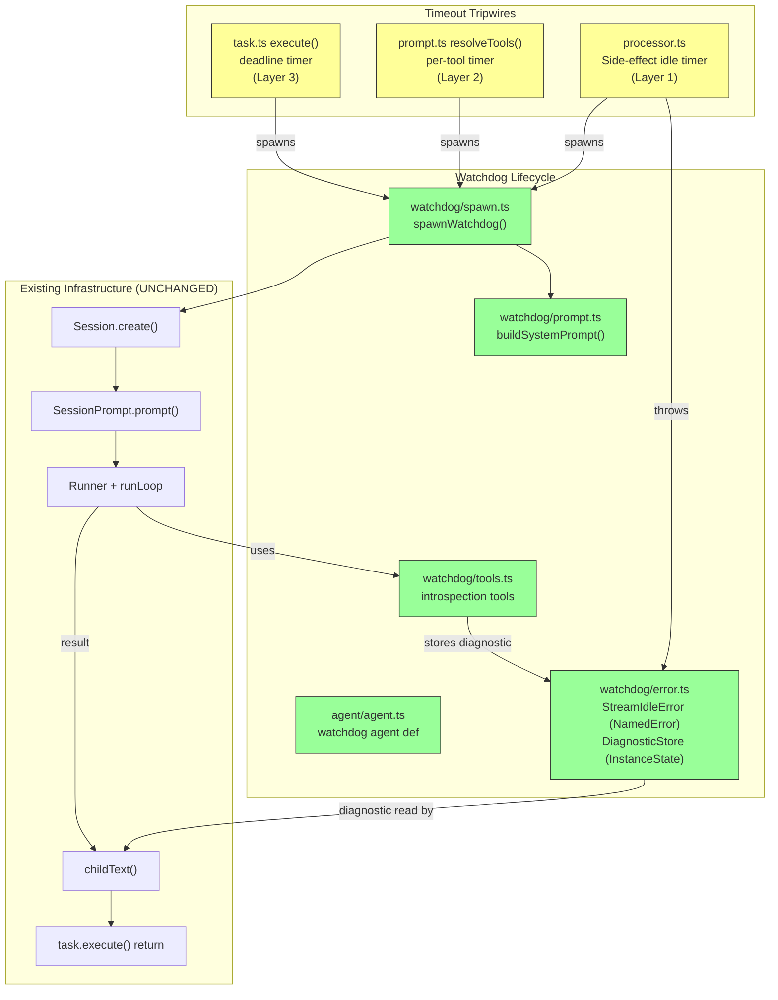

# Design Document: Intelligent Agent Watchdog

## Overview

OpenCode sessions stall silently when LLM streams hang, tools block indefinitely, or child sessions never return. Today, no production-ready detection or recovery mechanism exists.

**Current state**: No idle detection on the LLM stream pipeline. `bash` has a 2-minute timeout that kills the process. `task` has a 4-hour deadline that cancels the child. Other tools have no timeouts. No introspection, no diagnostic reports.

**Target state**: Configurable per-tool-type timeout tripwires that spawn lightweight LLM watchdog agents. Each watchdog introspects the stuck session via DB queries, classifies the failure mode, attempts recovery (re-prompt), and delivers a structured diagnostic report to the parent session through the existing `childText()` transport.

**Source references**: `specs/intelligent-watchdog/goal.md`, `specs/intelligent-watchdog/requirements.md`

### Key Design Decisions

1. **Watchdog as regular child session**: Reuses `Session.create` + `SessionPrompt.prompt` + `Runner` for ~30 lines of new code vs 200-400 for out-of-band execution. Gets tool dispatch, message persistence, compaction, and retry for free.

2. **Child of the parent, not child of the stuck session**: The watchdog must outlive the stuck session and report to the parent. Creating it as the parent's child ensures the diagnostic result flows through `task.execute()` → parent LLM context.

3. **Side-effect idle timer for Layer 1 detection**: Neither `Stream.timeoutFail` nor `Stream.timeoutOrElse` exist in Effect v4.0.0-beta.43. Instead, a `setTimeout`-based idle timer is integrated into the stream pipeline via `Stream.tap`. Each semantic event resets the timer. When the timer fires (no events for the configured idle duration), it triggers a `StreamIdleError` and spawns a watchdog. This follows the same `setTimeout` pattern as tool timeout tripwires (Component 7), providing a consistent approach across all three layers.

4. **Existing `childText()` as diagnostic transport**: Modifying the WATCHDOG path in `childText()` to embed the actual diagnostic report means zero new transport mechanisms. The parent LLM sees a rich explanation as the tool result.

5. **DB-only introspection (no bus events for watchdog)**: The watchdog queries the database synchronously via `Database.use()`. Bus events are in-memory and not available to the watchdog session. `time_created` on parts (not `time_updated`) is the reliable activity signal.

6. **Per-tool-type timeouts in `experimental` config**: Follows the existing `mcp_timeout` pattern. Keeps the feature behind the `experimental` section for gradual rollout.

## Architecture



**Legend**: Yellow = NEW tripwire insertion points. Green = NEW watchdog modules. White = EXISTING infrastructure (unchanged).

## Components and Interfaces

### 1. WatchdogConfig (config schema extension)

**Purpose**: Extend the `experimental` config section with watchdog-specific settings.

**Location**: `packages/opencode/src/config/config.ts` (MODIFIED)

**Schema additions** (inside existing `experimental` z.object):

```ts
watchdog: z.object({
  model: z.object({
    providerID: z.string(),
    modelID: z.string(),
  }).optional()
    .describe("Model for watchdog agents. Defaults to provider's small/fast model."),
  timeouts: z.object({
    stream_idle: z.number().int().positive().optional()
      .describe("LLM stream idle timeout in seconds. Default: 120"),
    task: z.number().int().positive().optional()
      .describe("Task tool timeout in seconds. Default: 14400"),
    bash: z.number().int().positive().optional()
      .describe("Bash tool timeout in seconds. Default: 120"),
    tool_default: z.number().int().positive().optional()
      .describe("Default tool timeout in seconds for tools without a specific entry. Default: 300"),
  }).optional()
    .describe("Per-tool-type timeout thresholds that trigger watchdog investigation."),
}).optional()
  .describe("Intelligent watchdog configuration for stuck session detection and recovery."),
```

**Default resolution** (in watchdog spawn logic, not in schema):

```ts
const DEFAULTS = {
  stream_idle: 120, // seconds
  task: 14400, // seconds (4 hours, matches existing DEFAULT_TIMEOUT)
  bash: 120, // seconds (matches existing bash timeout)
  tool_default: 300, // seconds (5 minutes for tools without specific config)
} as const
```

### 2. WatchdogAgent (agent definition)

**Purpose**: Define the watchdog as a built-in agent with maximally restricted permissions plus read-only introspection tools.

**Location**: `packages/opencode/src/agent/agent.ts` (MODIFIED — add to `agents` record)

**Definition** (follows `compaction`/`title`/`summary` pattern):

```ts
watchdog: {
  name: "watchdog",
  mode: "subagent",
  native: true,
  hidden: true,
  permission: Permission.merge(
    defaults,
    Permission.fromConfig({
      "*": "deny",
      watchdog_query: "allow",
      watchdog_activity: "allow",
      watchdog_cancel: "allow",
      watchdog_reprompt: "allow",
    }),
    user,
  ),
  prompt: "", // injected dynamically by buildSystemPrompt()
  options: {},
  steps: 20, // hard limit on watchdog reasoning steps. Minimum path: ~6 tool calls (2 queries + 1 reprompt + up to 2 re-queries + 1 cancel). 20 provides headroom for deliberate multi-step diagnosis without runaway behavior.
},
```

**Default model lookup table** (used when `experimental.watchdog.model` is not configured):

```ts
const WATCHDOG_DEFAULT_MODELS: Record<string, string> = {
  anthropic: "claude-haiku-4-5",
  openai: "gpt-4o-mini",
  google: "gemini-1.5-flash",
}
// For unknown providers: use the first model from the user's configured provider
```

**Dynamic system prompt injection**: The `prompt: ""` field in the agent definition is a placeholder. The actual system prompt is passed as the `system` field in `SessionPrompt.prompt()` — `PromptInput` has `system: z.string().optional()` which is appended to the agent's base `prompt` in `session/llm.ts:102-114`. The `buildSystemPrompt()` call happens inside `spawnWatchdog()`, and the resulting string is passed as `system: await buildSystemPrompt(input)` in the `SessionPrompt.prompt()` call. There is no `systemPrompt` or `prompt` field on `Session.create()` — the options are `parentID`, `title`, `permission`, `workspaceID` only.

### 3. WatchdogSpawn (spawn orchestrator)

**Purpose**: Create a watchdog child session, inject context, and run it with a hard timeout.

**Location**: `packages/opencode/src/watchdog/spawn.ts` (NEW)

**Interface**:

```ts
interface SpawnInput {
  stuckSessionID: SessionID
  parentSessionID: SessionID
  trigger: {
    tool: string // tool name or "stream" for Layer 1
    timeout: number // configured timeout in seconds
    elapsed: number // actual elapsed time in seconds
  }
}

function spawnWatchdog(input: SpawnInput): Promise<WatchdogResult>

interface WatchdogResult {
  action: "none" | "reprompted" | "cancelled"
  diagnostic: string // full diagnostic report text
  sessionID: SessionID // watchdog's own session ID
}
```

**Behavior**:

1. Check that `parentSessionID` exists (top-level sessions have no parent — skip)
2. Create child session: `Session.create({ parentID: input.parentSessionID })`
3. Build system prompt via `buildSystemPrompt(input)` — returns a `string`
4. Call `SessionPrompt.prompt()` with `{ sessionID, agent: "watchdog", system: systemPrompt, parts: [...] }`. The `system` field in `PromptInput` appends to the agent's base `prompt` in `session/llm.ts`. The 60-second deadline uses `abortAfterAny(60_000, ctx.abort)` (from `src/util/abort.ts`) — the same mechanism used for the task tool's deadline (both ported from `local/tool-timeout`). Additionally, `raceSignal()` (to be created, ported from `local/session-watchdog`) combines the deadline signal with the parent's abort signal.
5. Extract result from watchdog session
6. On timeout: cancel stuck session with generic message, return `{ action: "cancelled", diagnostic: "Watchdog timed out..." }`

**Important**: `spawnWatchdog` is called as a fire-and-forget background effect using `Effect.forkIn(scope)` — the idiomatic pattern in this codebase (used at `session/prompt.ts:1384-1390`, `session/index.ts:409`, etc.). Never use `Effect.fork` or `Effect.forkDaemon` — neither appears anywhere in the codebase.

### 4. WatchdogPrompt (system prompt builder)

**Purpose**: Build the watchdog's system prompt with all context injected from the code side.

**Location**: `packages/opencode/src/watchdog/prompt.ts` (NEW)

**Interface**:

```ts
function buildSystemPrompt(input: SpawnInput): Promise<string>
```

**Behavior**:

1. Query DB for stuck session's latest assistant message (`MessageTable` WHERE `session_id`)
2. Query DB for stuck session's latest parts (`PartTable` WHERE `session_id`, ordered by `time_created DESC`, limit 10)
3. Query DB for session tree (`SessionTable` WHERE `parent_id = stuckSessionID` or `id = stuckSessionID`)
4. Compose system prompt template with:
   - Stuck session ID, parent session ID
   - Trigger info (tool name, timeout, elapsed)
   - DB snapshot (latest message data, latest parts with timing, session tree)
   - Activity signal inventory and interpretation guide
   - Available actions (query, re-prompt, cancel) and decision criteria
   - Strict scoping: "You may ONLY act on session {stuckSessionID}"

### 5. WatchdogTools (introspection tool definitions)

**Purpose**: Define read-only tools the watchdog uses to query session state.

**Location**: `packages/opencode/src/watchdog/tools.ts` (NEW)

**Tools** (4 tools, registered via `Tool.define(id, def)`). All `execute` functions return `{ title, metadata, output }` per the `Def` interface. `Database.use(fn)` is synchronous — wrap with `Effect.sync(() => Database.use(fn))` inside `Effect.gen`, or call directly in `async execute` (which is also acceptable per the three codebase patterns for `Database.use`).

#### 5a. `watchdog_query`

```ts
export const WatchdogQueryTool = Tool.define("watchdog_query", {
  description: "Query the database for stuck session state. SELECT-only — no mutations.",
  parameters: z.object({
    session_id: z.string().describe("Session ID to query"),
    query: z.enum([
      "latest_message", // latest assistant message with data.time.completed and data.finish
      "running_tools", // tool parts in running state with state.time.start
      "latest_parts", // last 10 parts by time_created
      "session_tree", // parent/child session relationships via parent_id
      "lifecycle_pairs", // unmatched step-start events without step-finish
    ]),
  }),
  async execute(params, _ctx) {
    const result = Database.use((db) => {
      /* Drizzle SELECT query per params.query */
    })
    return { title: `query:${params.query}`, metadata: {}, output: JSON.stringify(result) }
  },
})
```

#### 5b. `watchdog_activity`

```ts
export const WatchdogActivityTool = Tool.define("watchdog_activity", {
  description: "Check when the last new part was created for a session.",
  parameters: z.object({
    session_id: z.string().describe("Session ID to check"),
  }),
  async execute(params, _ctx) {
    const max = Database.use((db) =>
      db
        .select({ max: sql<number>`MAX(${PartTable.time_created})` })
        .from(PartTable)
        .where(eq(PartTable.session_id, params.session_id))
        .get(),
    )
    const now = Date.now()
    const result = { max_part_created: max?.max ?? null, now, age_ms: max?.max ? now - max.max : null }
    return { title: "activity", metadata: {}, output: JSON.stringify(result) }
  },
})
```

#### 5c. `watchdog_cancel`

```ts
export const WatchdogCancelTool = Tool.define("watchdog_cancel", {
  description: "Cancel the stuck session with a diagnostic report after confirming no recovery.",
  parameters: z.object({
    session_id: z.string().describe("Session ID to cancel — must match the stuck session from context"),
    reason: z.string().describe("Full diagnostic report: failure mode, evidence, recommendation"),
  }),
  async execute(params, ctx) {
    // Scope validation: session_id must match the stuck session injected in system prompt
    // (validated by checking ctx.extra?.stuckSessionID injected at spawn time)
    // Idempotent safety check: abort if session recovered in last 10s
    const activity = Database.use(/* MAX(time_created) query */)
    if (activity && Date.now() - activity < 10_000)
      return { title: "cancel:aborted", metadata: {}, output: "Session recovered during cancel — no action taken" }
    // Store diagnostic for childText() extraction, then cancel
    DiagnosticStore.set(params.session_id, params.reason) // via injected service
    await SessionPrompt.cancel(params.session_id)
    return { title: "cancel:ok", metadata: {}, output: `Cancelled session ${params.session_id}` }
  },
})
```

#### 5d. `watchdog_reprompt`

```ts
export const WatchdogRepromptTool = Tool.define("watchdog_reprompt", {
  description: "Send a nudge message to a stuck child session and poll for recovery.",
  parameters: z.object({
    session_id: z.string().describe("Session ID to nudge — must be a Layer 2/3 stall, not Layer 1"),
    message: z.string().describe("Nudge message to send"),
  }),
  async execute(params, _ctx) {
    // Send nudge — parts array is the correct field (no "content" field in PromptInput)
    await SessionPrompt.prompt({
      sessionID: params.session_id,
      parts: [{ type: "text", text: params.message }],
    })
    // Poll 5× at 2s intervals
    const polls: { time: number; max_created: number | null }[] = []
    let prev: number | null = null
    for (let i = 0; i < 5; i++) {
      if (i > 0) await new Promise((r) => setTimeout(r, 2000))
      const max = Database.use(/* MAX(time_created) */)?.max ?? null
      polls.push({ time: Date.now(), max_created: max })
      if (max !== null && prev !== null && max > prev)
        return { title: "reprompt:recovered", metadata: {}, output: JSON.stringify({ recovered: true, polls }) }
      prev = max
    }
    return { title: "reprompt:no-recovery", metadata: {}, output: JSON.stringify({ recovered: false, polls }) }
  },
})
```

### 6. StreamIdleDetector (Layer 1 tripwire)

**Purpose**: Insert a side-effect idle timer into the processor's LLM stream pipeline to detect hung streams.

**Location**: `packages/opencode/src/session/processor.ts` (MODIFIED)

**Insertion point**: Inside the `Stream.tap(handleEvent)` callback — the timer reset is a side-effect alongside event handling.

**Current pipeline** (`processor.ts:456-460`):

```ts
yield *
  stream.pipe(
    Stream.tap((event) => handleEvent(event)),
    Stream.takeUntil(() => ctx.needsCompaction),
    Stream.runDrain,
  )
```

**Modified pipeline**:

```ts
// Side-effect idle timer — resets on every event, fires StreamIdleError when idle
const idle = startStreamIdleTripwire({
  sessionID: ctx.sessionID,
  timeout: idleTimeout, // seconds, from config
  onIdle: () => {
    // Signal the stream to abort and spawn a watchdog
    ctx.abort.abort(new StreamIdleError({ sessionID: ctx.sessionID, timeout: idleTimeout }))
  },
})

yield *
  stream.pipe(
    Stream.tap((event) => {
      idle.reset() // reset idle timer on every semantic event
      return handleEvent(event)
    }),
    Stream.takeUntil(() => ctx.needsCompaction),
    Stream.runDrain,
  )

idle.clear() // clean up if stream completed normally
```

**`startStreamIdleTripwire` helper** (follows the same `setTimeout`-based pattern as `startToolTripwire` from Component 7):

```ts
function startStreamIdleTripwire(input: {
  sessionID: string
  timeout: number // seconds
  onIdle: () => void
}): { reset: () => void; clear: () => void } {
  let cleared = false
  let handle = setTimeout(() => {
    if (cleared) return
    input.onIdle()
  }, input.timeout * 1000)
  return {
    reset: () => {
      if (cleared) return
      clearTimeout(handle)
      handle = setTimeout(() => {
        if (cleared) return
        input.onIdle()
      }, input.timeout * 1000)
    },
    clear: () => {
      cleared = true
      clearTimeout(handle)
    },
  }
}
```

Each semantic event from the AI SDK calls `idle.reset()`, which clears the existing timer and starts a new one. Slow-but-streaming models (emitting reasoning deltas) continually reset the timer and do not trigger false alarms. When the timer fires (no events for the configured idle duration), it calls `onIdle()` which aborts the stream and triggers watchdog spawn logic.

**`StreamIdleError`**: Defined using the codebase's `NamedError.create()` factory from `packages/util/src/error.ts`. This gives a class with a static `.isInstance()` predicate used for pattern matching:

```ts
// watchdog/error.ts
import { NamedError } from "@opencode/util/error"
import { z } from "zod"

export const StreamIdleError = NamedError.create(
  "StreamIdleError",
  z.object({
    sessionID: z.string(),
    timeout: z.number(),
  }),
)
```

**Layer 1 `spawnWatchdog` mapping**: For a Layer 1 stall, `stuckSessionID` = the session whose stream hung (carried in `StreamIdleError.sessionID`). `parentSessionID` = that session's `parent_id` looked up from `SessionTable`. If `parent_id` is null (top-level session), no watchdog is spawned per Requirement 2.9. The Layer 1 watchdog does NOT attempt re-prompt (per Requirement 4.2a) — the stream itself has hung, so sending a message into the session would not reach it. The watchdog classifies the failure mode from DB state and proceeds directly to cancel-with-diagnostic.

**Error handling integration**: After the stream drains (or aborts), `StreamIdleError` is caught using `Effect.catchCauseIf` with cause inspection — the codebase's standard error catch pattern at `processor.ts:463-466`. A new `catchCauseIf` block is inserted **before** the existing one:

1. The new block checks if the cause contains a `StreamIdleError` (via `Cause.find` + `StreamIdleError.isInstance`).
2. If matched: spawns a watchdog as a **background side effect** using `Effect.forkIn(scope)` — the idiomatic fire-and-forget pattern throughout this codebase (e.g., `session/prompt.ts:1384-1390`). `Effect.fork` and `Effect.forkDaemon` are not used anywhere in the codebase.
3. Returns `Effect.fail(error)` to **halt the current prompt cycle** — the processor does NOT auto-retry after `StreamIdleError`.
4. The watchdog runs independently in its forked fiber. If it determines the session is stuck, it cancels it via `watchdog_cancel`. If healthy, it exits cleanly.
5. Recovery responsibility belongs to the watchdog and the parent session — the processor's own `Effect.retry` (for 429/503 API errors) is NOT involved in `StreamIdleError` handling.

The existing `Effect.catchCauseIf(!Cause.hasInterruptsOnly)` at `processor.ts:463` handles all other non-interrupt errors (squashing them for retry). `StreamIdleError` is caught before reaching that block, so retry is bypassed.

### 7. ToolTimeoutTripwire (Layer 2 tripwire)

**Purpose**: Wrap tool execution with a timer that spawns a watchdog when the timeout fires (without killing the tool).

**Location**: `packages/opencode/src/session/prompt.ts` (MODIFIED — inside `resolveTools()` at the `execute` closure)

**Why `prompt.ts`, not `processor.ts`**: Tool execution is dispatched by the Vercel AI SDK's `streamText()`, which calls `execute` closures built in `resolveTools()` (`prompt.ts:388`). Built-in tools dispatch at `prompt.ts:454` (`item.execute(args, ctx)`), MCP tools at `prompt.ts:493-495`. `processor.ts` only observes `tool-result` events passively — it never dispatches execution.

**Approach**: Inside each `execute` closure in `resolveTools()`, start a background timer alongside the actual `item.execute()` call. If the timer fires before execution completes, spawn a watchdog in the background. The tool continues running — the watchdog investigates independently. When execution completes, clear the timer.

**Dispatch chain** (for reference):

```
runLoop (prompt.ts:1337)
  → handle.process(streamInput)        [processor.ts:447]
    → llm.stream(streamInput)          [processor.ts:456 → llm.ts:56]
      → streamText({ tools, ... })     [llm.ts:268] — Vercel AI SDK
        → tool.execute(args, options)   [AI SDK internals]
          ↳ [built-in] item.execute(args, ctx)  ← prompt.ts:454
          ↳ [MCP]      execute(args, opts)       ← prompt.ts:493-495
```

**Interface**:

```ts
function startToolTripwire(input: {
  sessionID: SessionID
  parentSessionID: SessionID | undefined
  tool: string
  timeout: number // seconds
}): { clear: () => void }
```

**`clear()` atomicity contract**: `clear()` MUST atomically prevent the watchdog spawn even if the timer has already elapsed. The implementation MUST use a boolean `cleared` flag set by `clear()` that is checked inside the timer callback before spawning. A plain `clearTimeout()` is insufficient because it does not cancel a callback that has already been enqueued in the microtask queue. Pattern:

```ts
function startToolTripwire(input): { clear: () => void } {
  let cleared = false
  const handle = setTimeout(() => {
    if (cleared) return // atomic guard
    spawnWatchdog(...)
  }, input.timeout * 1000)
  return { clear: () => { cleared = true; clearTimeout(handle) } }
}
```

**Integration**: Wrap both callsites in `resolveTools()`:

```ts
// Built-in tools (prompt.ts:454, conceptual)
const tripwire = startToolTripwire({ sessionID, parentSessionID, tool: item.name, timeout })
const result = yield * Effect.promise(() => item.execute(args, ctx))
tripwire.clear()

// MCP tools (prompt.ts:493-495, same pattern)
const tripwire = startToolTripwire({ sessionID, parentSessionID, tool: name, timeout })
const result = yield * Effect.promise(() => execute(args, opts))
tripwire.clear()
```

### 8. TaskTimeoutEnhancement (Layer 3 tripwire)

**Purpose**: Enhance the `task` tool's existing deadline to spawn a watchdog instead of immediately cancelling the child session.

**Location**: `packages/opencode/src/tool/task.ts` (MODIFIED)

**Current behavior** (`task.ts` on `upstream/dev`): The task tool has no timeout or deadline mechanism — `task.ts` is 166 lines and simply creates a child session, calls `SessionPrompt.prompt()`, and extracts the result inline at line 146 (`result.parts.findLast(x => x.type === "text")?.text`). There is no `DEFAULT_TIMEOUT`, no `abortAfterAny` deadline, and no `childText()` function.

**New behavior** (ported from `local/tool-timeout` + `local/session-watchdog` + new watchdog logic):

1. Add `DEFAULT_TIMEOUT = 14_400_000` (4 hours) and `MIN_TIMEOUT` constants (from `local/tool-timeout`)
2. Add `timeout` parameter to the task tool definition (from `local/tool-timeout`)
3. Wrap execution with `abortAfterAny(ms, ctx.abort)` deadline (from `local/tool-timeout`)
4. Create `childText()` function for result extraction with multiple paths (from `local/session-watchdog` design)
5. Add `raceSignal()` to `src/util/abort.ts` for combining abort signals (from `local/session-watchdog`)
6. When the deadline fires: spawn a watchdog via `spawnWatchdog()` (instead of immediately cancelling)
7. The watchdog investigates and decides to cancel or not
8. If the watchdog itself times out (60s), the stuck session is cancelled with a generic message

### 9. ChildTextCreation (diagnostic transport)

**Purpose**: Create a `childText()` function for extracting child session results, with a WATCHDOG path that embeds the diagnostic report.

**Location**: `packages/opencode/src/tool/task.ts` (MODIFIED — new function)

**Current state** (`upstream/dev`): Result extraction is inline at `task.ts:146`: `result.parts.findLast(x => x.type === "text")?.text`. There is no `childText()` function and no WATCHDOG error handling path.

**New `childText()` function** (inspired by `local/session-watchdog` design): Extracts the result string from a completed/aborted child session, with 5 return paths:

1. **Normal completion** — extracts latest assistant text part
2. **Empty response** — returns generic "no content" message
3. **Error** — returns error string from the error cause
4. **WATCHDOG abort with diagnostic** — reads diagnostic from `DiagnosticStore`, embeds full report
5. **WATCHDOG abort without diagnostic** — returns generic abort message with session/task ID

**Storage mechanism**: Use the codebase's `Context.Tag` + `Layer.effect` pattern (following `session/status.ts` conventions). The `EffectService` helper referenced in the original design does NOT exist — use the actual pattern:

```ts
// watchdog/error.ts
import { Context, Layer, Effect } from "effect"

// Diagnostic store: maps stuck sessionID → diagnostic report string
export class DiagnosticStore extends Context.Tag("DiagnosticStore")<
  DiagnosticStore,
  {
    set(id: string, report: string): void
    get(id: string): string | undefined
    delete(id: string): void
  }
>() {}

export const DiagnosticStoreLive = Layer.effect(
  DiagnosticStore,
  Effect.sync(() => {
    const store = new Map<string, string>()
    return {
      set: (id: string, report: string) => store.set(id, report),
      get: (id: string) => store.get(id),
      delete: (id: string) => {
        store.delete(id)
      },
    }
  }),
)
```

**Implementor note**: Verify the `Context.Tag` exact signature against `packages/opencode/src/session/status.ts` and follow the exact pattern used there. The `InstanceState.make` pattern from `status.ts` is the idiomatic approach for mutable state in this codebase — the implementor should evaluate whether `InstanceState` or a plain `Context.Tag`-backed `Map` is more appropriate given that the `DiagnosticStore` only needs to be process-scoped (not directory-scoped). The key requirement is that this store is injectable (not a module-level singleton) so that tests can reset it between runs.

**Memory leak prevention**: (unchanged) Entries removed (a) immediately after `childText()` reads (happy path), (b) via lazy eviction of entries older than 5 minutes during each `spawnWatchdog()` call.

## Data Flow

### Happy Path: Tool Timeout → Watchdog → Cancel with Diagnostic

```
1. Tool starts executing
   └─ startToolTripwire() sets timer [prompt.ts resolveTools()]

2. Timer fires (tool exceeded timeout)
   └─ spawnWatchdog({ stuckSessionID, parentSessionID, trigger }) [watchdog/spawn.ts]

3. Watchdog session created as child of parent
   └─ Session.create({ parentID: parentSessionID }) [session/index.ts]
   └─ buildSystemPrompt() injects context [watchdog/prompt.ts]

4. Watchdog runs with 60s hard timeout
   └─ SessionPrompt.prompt() → runLoop → tool dispatch [session/prompt.ts]

5. Watchdog queries DB via watchdog_query tool
   └─ Database.use((db) => db.select()...) [watchdog/tools.ts]
   └─ Classifies failure mode: hung stream / stuck tool / etc.

6. Watchdog attempts re-prompt via watchdog_reprompt tool
   └─ Sends nudge, polls MAX(time_created) 5× at 2s intervals
   └─ No progress detected

7. Watchdog cancels via watchdog_cancel tool
   └─ Stores diagnostic in diagnosticReports Map
   └─ SessionPrompt.cancel(stuckSessionID) [session/prompt.ts]

8. Stuck child session aborts
   └─ childText() extracts diagnostic from Map [tool/task.ts]
   └─ Returns rich diagnostic as tool result

9. Parent LLM receives diagnostic in tool-result event
   └─ Decides: retry, skip, or try different approach
```

### Layer 1: Stream Idle → Watchdog → Halt

```
1. LLM stream goes idle (no semantic events)
   └─ Side-effect idle timer fires after idle_timeout [processor.ts]
   └─ StreamIdleError thrown (NamedError.create)

2. Error caught by Effect.catchCauseIf (cause inspection for StreamIdleError)
   └─ Spawn watchdog in background (Effect.forkIn(scope)) for the session's parent
   └─ Return Effect.fail(error) — halt current prompt cycle (no retry)
   └─ Existing Effect.catchCauseIf at processor.ts:463 is bypassed for this error type

3. Watchdog investigates independently
   └─ If stuck: cancel stuck session, diagnostic delivered to parent
   └─ If healthy: exit with no action
```

### Re-prompt → Poll → Cancel Sequence

```
Watchdog                    Stuck Session           Database
  │                              │                      │
  ├─ watchdog_reprompt ─────────►│                      │
  │  (nudge message)             │                      │
  │                              ├── creates new part ─►│
  │                              │                      │
  ├─ poll 1 (t=0s) ────────────────────────────────────►│
  │◄─ MAX(time_created) = T₁ ──────────────────────────┤
  │                              │                      │
  ├─ wait 2s                     │                      │
  │                              │                      │
  ├─ poll 2 (t=2s) ────────────────────────────────────►│
  │◄─ MAX(time_created) = T₂ ──────────────────────────┤
  │                              │                      │
  ├─ T₂ > T₁? ──► YES: return { recovered: true }      │
  │           └──► NO: continue polling                 │
  │                              │                      │
  ├─ ... polls 3-5 at 2s intervals ...                  │
  │                              │                      │
  ├─ All 5 polls, no advancement                        │
  │  └─ return { recovered: false }                     │
  │                              │                      │
  ├─ watchdog_cancel ───────────►│                      │
  │  (stores diagnostic in Map)  │                      │
  │                              ├── SessionPrompt      │
  │                              │   .cancel()          │
  │                              │                      │
  │                              ├── childText()        │
  │                              │   reads diagnostic   │
  │                              │   from Map           │
  └── watchdog exits             └── parent receives    │
                                     diagnostic as      │
                                     tool-result        │
```

### Race Condition: Organic Recovery During Watchdog Investigation

If the stuck session resumes organically (e.g., the LLM provider responds after a long delay) while the watchdog is still investigating, the following sequence occurs:

1. The watchdog's next `watchdog_activity` or `watchdog_query` call observes that `MAX(time_created)` has advanced or that tool parts have transitioned out of `running` state.
2. The watchdog classifies the session as **healthy** and exits with `action: "none"`.
3. No cancel or re-prompt is issued.

Similarly, if organic recovery happens after the watchdog issues a `watchdog_reprompt` but before the cancel decision:

1. The re-prompt poll detects `MAX(time_created)` advancement → returns `{ recovered: true }`.
2. The watchdog exits without calling `watchdog_cancel`.

The `watchdog_cancel` tool itself also performs an idempotent safety check: before calling `SessionPrompt.cancel()`, it re-queries `MAX(time_created)` one final time. If the session has shown activity within the last **10 seconds**, it aborts the cancel and returns `"Session recovered during cancel — no action taken"`. (The 10-second threshold here is distinct from the 30-second initial classification threshold in Requirement 3.7 — it is a narrower last-moment guard.) This prevents the race where the watchdog decides to cancel based on stale poll data but the session recovers in the gap between the decision and execution.

### `childText()` Design

The new `childText()` function in `tool/task.ts` replaces the current inline result extraction at `task.ts:146`. It provides 5 return paths:

1. **Normal completion** — extracts assistant text (inline extraction moved here)
2. **Empty response** — returns generic message
3. **Error** — returns error string
4. **WATCHDOG abort with diagnostic** — reads diagnostic from `DiagnosticStore`, embeds full report
5. **WATCHDOG abort without diagnostic** — returns generic abort message

The key design: when a child session is cancelled by the watchdog, `childText()` checks the `DiagnosticStore` for a diagnostic report keyed by session ID. If present, the diagnostic is embedded in the tool result. If not (e.g., user-initiated cancel), a generic message is returned. This ensures the parent LLM always receives actionable information when a watchdog is involved.

## File Structure

### New Files

| Path                                             | Purpose                                                                               |
| ------------------------------------------------ | ------------------------------------------------------------------------------------- |
| `packages/opencode/src/watchdog/spawn.ts`        | Watchdog spawn orchestrator — creates session, injects prompt, runs with hard timeout |
| `packages/opencode/src/watchdog/prompt.ts`       | System prompt builder — queries DB snapshot, composes context-rich prompt             |
| `packages/opencode/src/watchdog/tools.ts`        | Four introspection tools (query, activity, cancel, reprompt)                          |
| `packages/opencode/src/watchdog/error.ts`        | `StreamIdleError` (NamedError) + `DiagnosticStore` service (InstanceState-backed)     |
| `packages/opencode/test/watchdog/spawn.test.ts`  | Tests for watchdog spawn lifecycle                                                    |
| `packages/opencode/test/watchdog/tools.test.ts`  | Tests for introspection tools                                                         |
| `packages/opencode/test/watchdog/prompt.test.ts` | Tests for system prompt builder                                                       |
| `packages/opencode/test/watchdog/config.test.ts` | Tests for config schema validation, default resolution, override merging              |

### Modified Files

| Path                                         | Changes                                                                                                                                                     |
| -------------------------------------------- | ----------------------------------------------------------------------------------------------------------------------------------------------------------- |
| `packages/opencode/src/config/config.ts`     | Add `watchdog` subsection to `experimental` schema                                                                                                          |
| `packages/opencode/src/agent/agent.ts`       | Add `watchdog` agent definition to `agents` record                                                                                                          |
| `packages/opencode/src/session/processor.ts` | Insert side-effect idle timer in stream pipeline; add `Effect.catchCauseIf` handler for `StreamIdleError` before existing `catchCauseIf`                    |
| `packages/opencode/src/session/prompt.ts`    | Wrap tool `execute` closures in `resolveTools()` with per-tool-type timeout tripwires                                                                       |
| `packages/opencode/src/tool/task.ts`         | Add `DEFAULT_TIMEOUT`/deadline wrapping (from `local/tool-timeout`); create `childText()` function with WATCHDOG diagnostic path; spawn watchdog on timeout |
| `packages/opencode/src/util/abort.ts`        | Add `raceSignal()` helper for combining abort signals (from `local/session-watchdog`)                                                                       |

## Error Handling

### Failure Modes

| Failure                                          | Detection                                                        | Recovery                                                               |
| ------------------------------------------------ | ---------------------------------------------------------------- | ---------------------------------------------------------------------- |
| Watchdog LLM call hangs                          | 60-second hard timeout via `abortAfterAny` (`src/util/abort.ts`) | Kill watchdog, cancel stuck session with generic message               |
| Watchdog model unavailable                       | `SessionPrompt.prompt()` throws provider error                   | Cancel stuck session with generic message including the provider error |
| Stuck session completes before watchdog finishes | Watchdog observes healthy state via DB queries                   | Watchdog exits with `action: "none"`                                   |
| Multiple simultaneous stalls                     | Each timeout spawns its own watchdog                             | Watchdogs are independent sessions — no interference                   |
| Stuck session has no parent (top-level)          | `parentSessionID` is undefined                                   | Do not spawn watchdog — top-level sessions have no parent to report to |
| DB query fails during introspection              | `Database.use()` throws                                          | Watchdog catches error, cancels stuck session with generic message     |
| Re-prompt triggers infinite loop                 | Watchdog has `steps: 20` limit                                   | Step limit kills watchdog, falls back to cancel                        |

### Exception Types

| Type              | Location            | Purpose                                                                                                                                                                                                                                                         |
| ----------------- | ------------------- | --------------------------------------------------------------------------------------------------------------------------------------------------------------------------------------------------------------------------------------------------------------- |
| `StreamIdleError` | `watchdog/error.ts` | Created via `NamedError.create("StreamIdleError", z.object({...}))`. Has static `.isInstance()` predicate. Carries `sessionID` and `timeout`. Caught by `Effect.catchCauseIf` with cause inspection before the existing `catchCauseIf` block in `processor.ts`. |

## Testing Strategy

### Unit Tests

**Framework**: `bun:test` (imports from `"bun:test"`)
**Location**: `packages/opencode/test/watchdog/`
**Runner**: `cd packages/opencode && bun test --timeout 30000`

| Test File                      | Coverage                                                                              |
| ------------------------------ | ------------------------------------------------------------------------------------- |
| `test/watchdog/spawn.test.ts`  | Watchdog session creation, hard timeout, result extraction, no-parent skip            |
| `test/watchdog/tools.test.ts`  | Each introspection tool's DB query correctness, scoping validation, re-prompt polling |
| `test/watchdog/prompt.test.ts` | System prompt contains all required context fields                                    |
| `test/watchdog/config.test.ts` | Config schema validation, default resolution, override merging                        |

### Integration Tests

| Test                              | Coverage                                                                                                  |
| --------------------------------- | --------------------------------------------------------------------------------------------------------- |
| Stream idle → watchdog spawn      | Side-effect idle timer fires, `Effect.catchCauseIf` handler triggers, watchdog forked via `forkIn(scope)` |
| Tool timeout → watchdog spawn     | Tool timer fires, watchdog investigates, cancel-with-diagnostic                                           |
| Task timeout → watchdog spawn     | Deadline fires, watchdog spawns (not immediate cancel)                                                    |
| Healthy session → no action       | Watchdog observes activity, exits cleanly                                                                 |
| Watchdog timeout → generic cancel | Watchdog exceeds 60s, stuck session cancelled with generic message                                        |

### Property-Based Tests

Property-based tests use `fast-check` (add as a dev dependency to `packages/opencode` if not already present: `bun add -d fast-check`). Tests import `bun:test` for the test runner and `fast-check` for generators. Do not write manual generators — use `fast-check`'s `fc.integer()`, `fc.string()`, `fc.array()`, `fc.record()` arbitraries.

## Correctness Properties

### Acceptance Criteria Analysis

1.1. WHEN a tool's execution duration exceeds the configured per-tool-type timeout threshold THE SYSTEM SHALL spawn a watchdog agent scoped to that specific tool invocation.
Testable: yes — property
Reasoning: For any tool type and any timeout value, exceeding the timeout always triggers a watchdog spawn. Universal over tool types and timeout durations.

1.2. WHEN a `task` tool invocation (child session) exceeds the configured task timeout threshold THE SYSTEM SHALL spawn a watchdog agent scoped to the stuck child session.
Testable: yes — property (subcase of 1.1)
Reasoning: Specialization of 1.1 for the task tool. Same universal property applies.

1.3. WHEN no semantic event arrives from the AI SDK on the processor's LLM stream for longer than the configured idle timeout duration THE SYSTEM SHALL spawn a watchdog agent to investigate the idle stream.
Testable: yes — property
Reasoning: For any idle timeout duration, a stream with no events for longer than that duration always triggers a watchdog. Universal over timeout values.

1.4. WHILE the LLM stream is receiving semantic events at intervals shorter than the idle timeout THE SYSTEM SHALL reset the idle timer on each event received.
Testable: yes — property
Reasoning: For any sequence of events arriving before the idle timeout, the stream should never trigger. Universal over event sequences.

1.5. THE SYSTEM SHALL provide per-tool-type timeout thresholds with the following defaults: `bash` 120 seconds, `task` 14400 seconds (4 hours), LLM stream idle 120 seconds.
Testable: yes — example
Reasoning: Specific enumerated default values — a fixed set, not a universal property.

1.6. WHERE the user has configured custom timeout thresholds in the `experimental` config section THE SYSTEM SHALL use the user-configured values instead of the defaults.
Testable: yes — property
Reasoning: For any valid positive integer timeout, the configured value overrides the default. Universal over config values.

1.7. WHEN a timeout tripwire fires THE SYSTEM SHALL allow the timed-out tool or stream to continue running while the watchdog investigates.
Testable: yes — property
Reasoning: For any timeout event, the timed-out operation continues running until the watchdog decides. Universal invariant.

1.8. IF the timed-out tool or task completes normally between the tripwire firing and the watchdog's investigation THE SYSTEM SHALL allow the watchdog to observe the healthy state and exit with no action.
Testable: yes — property
Reasoning: For any session that completes during watchdog investigation, the watchdog always classifies it as healthy. Idempotency property.

2.1. WHEN a watchdog is spawned THE SYSTEM SHALL create the watchdog as a child session of the parent session of the stuck session (not a child of the stuck session itself).
Testable: yes — property
Reasoning: For any watchdog spawn, the parent_id field always equals the parent of the stuck session. Universal over all spawn events.

2.2. WHEN a watchdog is spawned THE SYSTEM SHALL use the user-configured watchdog model; WHERE no watchdog model is configured THE SYSTEM SHALL use a hardcoded per-provider default fast model declared as a static lookup table in the spawn logic.
Testable: yes — example
Reasoning: Static lookup table — verifiable by checking the table contents. Not a universal property over inputs.

2.3. WHEN a watchdog is spawned THE SYSTEM SHALL inject into the watchdog's system prompt all of: the stuck session's ID, the parent session's ID, the triggering tool name, the timeout duration, the elapsed execution time, a snapshot of the stuck session's current DB state, the session tree, available actions, and the activity signal inventory.
Testable: yes — property
Reasoning: For any spawn input, the generated prompt always contains all required fields. Universal over inputs.

2.4. THE SYSTEM SHALL grant the watchdog agent exactly four tool permissions: two read-only introspection tools (`watchdog_query`, `watchdog_activity`) for database state examination, and two scoped action tools (`watchdog_reprompt`, `watchdog_cancel`) for recovery actions on the stuck session.
Testable: yes — example
Reasoning: Fixed permission set — verifiable by inspecting the agent definition. Not a universal property over inputs.

2.5. THE SYSTEM SHALL scope each watchdog's impact radius strictly to the stuck session the watchdog was spawned for and that session's parent.
Testable: yes — property
Reasoning: For any watchdog tool call targeting a session_id that doesn't match the stuck session, the tool rejects. Universal over session IDs.

2.6. WHEN multiple tool invocations or child sessions stall simultaneously THE SYSTEM SHALL spawn a separate watchdog for each stalled invocation, each scoped to its own stuck session.
Testable: yes — property
Reasoning: For any N simultaneous stalls, N independent watchdogs are created with distinct scopes. Universal over concurrency counts.

2.7. WHEN a watchdog's execution exceeds 60 seconds THE SYSTEM SHALL kill the watchdog and cancel the stuck session with a generic abort message.
Testable: yes — property
Reasoning: For any watchdog that exceeds 60s, it is always killed. Universal over execution durations.

2.8. THE SYSTEM SHALL NOT spawn a watchdog to monitor another watchdog (no recursive watchdog-of-watchdog).
Testable: yes — property
Reasoning: For any session identified as a watchdog session, no timeout tripwire spawns a watchdog for it. Universal over session types.

2.9. IF the stuck session has no parent session (the stuck session is the top-level user session) THE SYSTEM SHALL NOT spawn a watchdog.
Testable: yes — property
Reasoning: For any top-level session (parent_id = null), no watchdog is spawned. Universal over session types.

3.1. WHEN the watchdog introspects a session THE SYSTEM SHALL query the database for the latest assistant message's `data.time.completed` and `data.finish` fields.
Testable: yes — example
Reasoning: Specific query structure — verifiable by checking query output format. Not a universal property.

3.2–3.5. (Remaining query criteria)
Testable: yes — example
Reasoning: Each defines a specific DB query to execute. Verifiable by checking output structure.

3.6. THE SYSTEM SHALL classify the stuck session into exactly one failure mode by applying a defined priority order.
Testable: yes — property
Reasoning: For any stuck session state, the classification is always exactly one of the four enumerated modes (priority order prevents ambiguity). Universal over session states. Exhaustive classification.

3.7. WHEN the watchdog detects that the stuck session's `MAX(time_created)` has advanced within the last 30 seconds THE SYSTEM SHALL classify the session as healthy.
Testable: yes — property
Reasoning: For any session with recent part creation, classification is always "healthy". Universal over timing.

3.8. THE SYSTEM SHALL NOT use `PartTable.time_updated` as an activity signal.
Testable: yes — example
Reasoning: Code review check — no query references `time_updated` on parts. Not a universal property.

4.1. WHEN the watchdog classifies a session as healthy THE SYSTEM SHALL exit with no action.
Testable: yes — property
Reasoning: For any healthy classification, no cancel or re-prompt is issued. Universal.

4.2. WHEN the watchdog classifies a session as stuck AND the stuck session is a child session (Layer 2 or Layer 3 stall) THE SYSTEM SHALL first attempt a re-prompt action.
Testable: yes — property
Reasoning: For any Layer 2/3 stall, re-prompt always precedes cancel. Universal.

4.2a. WHEN the watchdog classifies a session as stuck AND the stall is a Layer 1 hung LLM stream THE SYSTEM SHALL proceed directly to cancel-with-diagnostic without re-prompt.
Testable: yes — property
Reasoning: For any Layer 1 stall, the cancel path is taken directly. Universal.

4.3–4.5. (Re-prompt poll criteria)
Testable: yes — property
Reasoning: The re-prompt → poll → fallback sequence is deterministic given poll results. For any sequence of 5 polls, the decision is determined by whether max_created advances.

4.6–4.9. (Cancel and diagnostic criteria)
Testable: yes — property
Reasoning: For any cancel action, the diagnostic report always contains the required fields and is delivered via childText(). Universal.

5.1–5.5. (Transport criteria)
Testable: yes — property (5.2 is a round-trip), yes — example (others)
Reasoning: 5.2 is a round-trip property: diagnostic in → full transport chain → diagnostic out, content preserved. 5.3 (Layer 1) is a halt-only path — the processor does not retry after `StreamIdleError`.

6.1–6.6. (Config criteria)
Testable: yes — property (6.4 validation), yes — example (others)
Reasoning: 6.4 is universal over all integer values. Others are specific config behaviors.

7.1–7.6. (Preservation criteria)
Testable: yes — property (7.5, 7.6), yes — example (others)
Reasoning: 7.5 is universal: for any session with no timeout fired, zero watchdogs exist. 7.6 is verified by running the full test suite.

### Properties

**Property 1: Timeout-Triggers-Watchdog**
_For any_ tool execution that exceeds its configured timeout threshold, a watchdog session is created with `parent_id` equal to the parent of the stuck session.
**Validates: Requirements 1.1, 1.2, 1.3, 2.1**

**Property 2: Idle-Reset-Prevents-Trigger**
_For any_ sequence of stream events where every inter-event gap is shorter than the configured idle timeout, no `StreamIdleError` is raised.
**Validates: Requirements 1.4, 1.7**

**Property 3: Config-Override-Precedence**
_For any_ valid positive integer timeout configured in `experimental.watchdog.timeouts`, the effective timeout for that tool type equals the configured value (not the default).
**Validates: Requirements 1.6, 6.3, 6.4**

**Property 4: Watchdog-Scope-Isolation**
_For any_ watchdog tool call where the `session_id` parameter does not match the stuck session ID from the watchdog's spawn context, the tool rejects with an error.
**Validates: Requirements 2.5, 2.8**

**Property 5: Healthy-Session-No-Action**
_For any_ session where `MAX(time_created) FROM part` has advanced within the last 30 seconds, the watchdog classifies the session as healthy and takes no cancel or re-prompt action.
**Validates: Requirements 3.7, 4.1**

**Property 6: Failure-Mode-Exhaustive-Classification**
_For any_ stuck session state (combination of message timing fields, tool part states, and part creation timestamps), the classification is exactly one of: hung LLM stream, stuck tool, parent blocked on stuck child, or infinite empty-response loop.
**Validates: Requirements 3.6**

**Property 7: Re-prompt-Recovery-Detection**
_For any_ sequence of 5 polls of `MAX(time_created)` at 2-second intervals, if `max_created` advances between any two consecutive polls, the watchdog classifies the session as recovered and exits. If no advancement across all 5 polls, the watchdog falls back to cancel.
**Validates: Requirements 4.2, 4.2a, 4.3, 4.4, 4.5**

**Property 8: Diagnostic-Round-Trip**
_For any_ diagnostic report produced by the watchdog, the content is preserved through the full transport chain: watchdog output → `childText()` extraction → `task.execute()` return → parent `ToolPart.state.output`.
**Validates: Requirements 4.8, 5.1, 5.2**

**Property 9: Watchdog-Hard-Timeout**
_For any_ watchdog execution that exceeds 60 seconds, the watchdog is killed and the stuck session is cancelled.
**Validates: Requirements 2.7**

**Property 10: No-Tripwire-No-Watchdog**
_For any_ session where no timeout tripwire has fired, zero watchdog sessions exist with that session as the stuck target.
**Validates: Requirements 7.5**

**Property 11: No-Parent-No-Watchdog**
_For any_ top-level session (where `parent_id` is null), no watchdog is spawned regardless of timeout status.
**Validates: Requirements 2.9**
