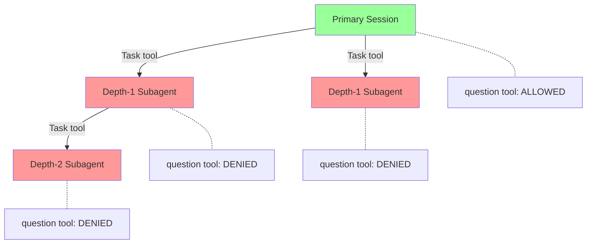

# Design Document: Headless Subagent Mode

## Overview

Currently, depth-1 subagent sessions (direct children of the primary session) can access the question tool, causing indefinite stalls. The fix removes the `nested` conditional in `task.ts` so that ALL subagent sessions have the question tool denied. Additionally, the error messages returned to parent LLMs when a child is killed are improved to distinguish three kill paths: user cancellation, deadline timeout, and watchdog kill.

**Current state**: The `nested` flag at `task.ts:133` checks if the _calling_ session has a parent. Only depth-2+ children get question denied. The `childText()` function returns `"Task was cancelled by user."` for all abort errors, including watchdog kills.

**Target state**: The question tool is unconditionally denied for all child sessions. Error messages are distinct for each kill path and include actionable guidance.

### Key Design Decisions

1. **Remove the `nested` conditional entirely**: Rather than fixing the depth check, unconditionally deny question for all child sessions. Simpler and correct by construction.
2. **Detect watchdog kills by signal state inference**: When `raceSignal` resolves in the try block with a `MessageAbortedError`, the task tool checks `ctx.abort.aborted` (user cancel) and `deadline.signal.aborted` (deadline timeout). If neither is true but the child was aborted, the kill must have come from an external source (the watchdog). This avoids modifying `prompt.ts` or `bootstrap.ts`.
3. **Keep changes to a single file**: Only `packages/opencode/src/tool/task.ts` needs code modification. Tests are added to `packages/opencode/test/session/task-error.test.ts`.

## Architecture



No new modules. Code changes are within `packages/opencode/src/tool/task.ts`. Test changes are within `packages/opencode/test/session/task-error.test.ts`.

## Components and Interfaces

### 1. Question Tool Denial (task.ts — Session.create call)

**Purpose**: Unconditionally deny question tool for all child sessions.

**Current code** (lines 164-172):

```typescript
...(nested
  ? [
      {
        permission: "question" as const,
        pattern: "*" as const,
        action: "deny" as const,
      },
    ]
  : []),
```

**New code**:

```typescript
{
  permission: "question" as const,
  pattern: "*" as const,
  action: "deny" as const,
},
```

The conditional is removed. The deny rule is always included.

### 2. Tools Map Exclusion (task.ts — SessionPrompt.prompt call)

**Purpose**: Unconditionally exclude question tool from the LLM tool list.

**Current code** (line 234):

```typescript
...(nested ? { question: false } : {}),
```

**New code**:

```typescript
question: false,
```

### 3. Remove `nested` Variable (task.ts:133)

**Purpose**: The `nested` variable is no longer used. Remove it to avoid dead code.

**Current code**:

```typescript
const nested = !!(await Session.get(ctx.sessionID)).parentID
```

**Removed entirely.**

### 4. Watchdog Kill Detection via Signal State (task.ts — try block, after raceSignal)

**Purpose**: Distinguish watchdog kills from user cancellations by checking which abort signals have fired.

**Mechanism**: When the watchdog calls `SessionPrompt.cancel(childSessionID)` (at `packages/opencode/src/project/bootstrap.ts:163`), the child session's abort controller fires. The child prompt resolves with a `MessageAbortedError` on the result. Back in the task tool's try block (after `raceSignal` at line 221), `childText()` is called. The function receives additional context about the abort signals.

**Current code** (line 45):

```typescript
if (error?.name === "MessageAbortedError" && !opts?.skipAbort) return "Task was cancelled by user."
```

**New code** — expand `childText()` opts to accept signal state:

```typescript
async function childText(
  result: Awaited<ReturnType<typeof SessionPrompt.prompt>>,
  id: string,
  opts?: { skipAbort?: boolean; parentAborted?: boolean; deadlineAborted?: boolean },
) {
  if (result.info.role !== "assistant") return ""
  const error = result.info.error
  if (error?.name === "MessageAbortedError" && !opts?.skipAbort) {
    // Deadline timeout: handled separately by the caller (TIMEOUT: path)
    if (opts?.deadlineAborted) return ""
    // User cancellation: parent abort was signaled
    if (opts?.parentAborted) return "Task was cancelled by user."
    // External kill (watchdog): child was aborted but neither parent nor deadline fired
    return [
      `WATCHDOG: Subagent session (${id}) was killed — tool execution exceeded maximum allowed duration.`,
      `task_id: ${id}`,
      "",
      "The subagent stalled (likely waiting on an external resource or internal deadlock).",
      "Recommended: retry this task with a simpler or more focused prompt.",
      "You can resume by passing the task_id above.",
    ].join("\n")
  }
  // ... rest of function unchanged
```

**Callers updated**:

- Line 248: `childText(result, session.id, { skipAbort: true })` — unchanged (deadline path, skipAbort handles it)
- Line 267: `childText(result, session.id)` → `childText(result, session.id, { parentAborted: ctx.abort.aborted, deadlineAborted: deadline.signal.aborted })`

### 5. Deadline Timeout Message Improvement (task.ts:249-256)

**Purpose**: Improve the nudge text in deadline timeout messages.

**Current code** (lines 254-255):

```typescript
"You can resume this task by passing the task_id above.",
"Recommended: retry up to 5 times before giving up.",
```

**New code**:

```typescript
"You can resume this task by passing the task_id above.",
"Recommended: retry with a simpler or more focused prompt. Break large tasks into smaller sub-tasks.",
```

Same change applies to the catch block at lines 302-304.

## Data Flow

### Question Tool Denial Flow

1. Parent LLM calls the Task tool → `task.ts:112` `execute()` runs.
2. `Session.create()` at line 141 includes the question deny rule unconditionally (line 164, modified).
3. `SessionPrompt.prompt()` at line 222 receives `tools: { question: false, ... }` unconditionally (line 234, modified).
4. Inside `resolveTools()` at `packages/opencode/src/session/llm.ts:281-290`, the `question: false` entry causes the question tool to be deleted from the tool map.
5. The child session's LLM never sees the question tool.

### Watchdog Kill Error Flow

1. Watchdog fires at `packages/opencode/src/project/bootstrap.ts:163`, calling `SessionPrompt.cancel(childSessionID)`.
2. The child's abort controller signals. The child processor catches `AbortError`.
3. The child's prompt resolves with `error.name === "MessageAbortedError"` on the result message.
4. Back in the parent's task tool try block, `raceSignal` resolves with the result.
5. `childText()` is called with `{ parentAborted: false, deadlineAborted: false }`.
6. Since neither parent nor deadline abort fired, `childText()` infers an external kill (watchdog) and returns a `WATCHDOG:` prefixed message with task_id and retry guidance.
7. The parent LLM receives the error text.

### Deadline Timeout Flow

1. The task tool's `abortAfterAny(ms, ctx.abort)` fires at line 217.
2. `raceSignal` at line 221 either resolves (prompt finished with abort) or rejects (deadline signal wins the race).
3. **Try block path** (lines 246-265): `deadline.signal.aborted && !ctx.abort.aborted` → returns `TIMEOUT:` prefixed message.
4. **Catch block path** (lines 289-307): Same check, returns `TIMEOUT:` prefixed message.

### User Cancellation Flow (unchanged)

1. User presses Ctrl+C → `SessionPrompt.cancel()` is called on the primary session.
2. The abort propagates to children via the `cancel` listener at line 207.
3. In the parent's task tool catch block at line 288, `ctx.abort.aborted` is true → re-throw.
4. The parent's own abort handler processes the cancellation.

## File Structure

### New Files

None.

### Modified Files

| Path                                                | Changes                                                                                                                                                                                                                                                                                   |
| --------------------------------------------------- | ----------------------------------------------------------------------------------------------------------------------------------------------------------------------------------------------------------------------------------------------------------------------------------------- |
| `packages/opencode/src/tool/task.ts`                | Remove `nested` variable (line 133). Unconditionally deny question tool in permission rules (lines 164-172) and tools map (line 234). Expand `childText()` opts to accept signal state for watchdog detection (line 38-45). Improve deadline timeout nudge text (lines 254-255, 302-304). |
| `packages/opencode/test/session/task-error.test.ts` | Add tests for: depth-1 question denial, watchdog kill error message content, deadline timeout message improvement.                                                                                                                                                                        |

## Error Handling

| Failure Mode               | Detection                                                     | Response                                                            |
| -------------------------- | ------------------------------------------------------------- | ------------------------------------------------------------------- |
| Watchdog kill              | `MessageAbortedError` + `!parentAborted` + `!deadlineAborted` | Return `WATCHDOG:` prefixed message with task_id and retry guidance |
| Deadline timeout           | `deadline.signal.aborted && !ctx.abort.aborted`               | Return `TIMEOUT:` prefixed message with task_id and retry guidance  |
| User cancellation (Ctrl+C) | `ctx.abort.aborted`                                           | Re-throw to parent's abort handler (existing behavior)              |
| Non-timeout error          | Catch block, neither abort nor deadline                       | Return `ERROR:` prefixed message with task_id (existing behavior)   |

## Testing Strategy

Tests run from `packages/opencode/` using `bun test`. The existing test file at `test/session/task-error.test.ts` uses a mock HTTP server pattern with `Bun.serve` to simulate LLM responses.

**New tests**:

1. **Depth-1 question denial**: Create a child session via the Task tool. Verify the session's permission rules include a question deny rule. Verify the tools map passed to `SessionPrompt.prompt()` includes `question: false`.

2. **Watchdog kill error message**: Simulate a watchdog kill by creating a child session and having its prompt resolve with a `MessageAbortedError` while neither deadline nor parent abort is fired. Verify the parent receives a message containing "WATCHDOG", the task_id, and retry guidance.

3. **Deadline timeout message**: Verify the deadline timeout message contains "TIMEOUT" and the improved nudge text (no "retry up to 5 times").

**Existing tests** (must continue passing):

- Task timeout and deadline behavior
- Grandchild hang rescue
- Parent abort breaking stuck children

## Correctness Properties

### Acceptance Criteria Analysis

1.1. WHEN the Task tool creates a child session THE SYSTEM SHALL add a permission deny rule for the question tool to the child session, regardless of the depth of the spawning session.
Testable: yes — property
Reasoning: For any child session created at any depth, the question deny rule must be present.

1.2. WHEN the Task tool invokes SessionPrompt.prompt() for a child session THE SYSTEM SHALL pass a tools map that excludes the question tool, regardless of the depth of the spawning session.
Testable: yes — property
Reasoning: For any child session at any depth, the tools map must include `question: false`.

1.3. THE SYSTEM SHALL apply both the permission deny rule and the tools map exclusion together for every subagent session — never one mechanism without the other.
Testable: yes — property
Reasoning: For any child session, the permission deny rule and tools map exclusion are always co-present.

1.4. WHEN a subagent session's LLM tool list is resolved via resolveTools() THE SYSTEM SHALL exclude the question tool from the list passed to streamText().
Testable: yes — example (requires integration test with resolveTools)
Reasoning: Tested via the tools map exclusion; resolveTools already deletes `false` entries.

1.5. WHEN a primary session (a session without a parentID) is created THE SYSTEM SHALL retain the question tool in the LLM tool list, subject to agent definition permissions.
Testable: yes — example
Reasoning: Primary sessions don't go through the Task tool path. Tested by verifying the primary session flow doesn't deny question.

1.6. IF an agent definition explicitly allows the question tool for a subagent session THEN THE SYSTEM SHALL deny the question tool via the session-level deny rule, overriding the agent-level default.
Testable: yes — example
Reasoning: The session-level deny rule takes precedence in resolveTools. Existing behavior, verified by checking deny rule presence.

2.1. WHEN the watchdog kills a child session THE SYSTEM SHALL return an error message to the parent that contains the phrase "watchdog" or "maximum allowed duration".
Testable: yes — property
Reasoning: For any watchdog-killed session, the error message must contain the watchdog identifier.

2.2. WHEN the watchdog kills a child session THE SYSTEM SHALL include the child session's task_id in the error message returned to the parent.
Testable: yes — property
Reasoning: For any watchdog-killed session, the task_id must appear in the error text.

2.3. WHEN the watchdog kills a child session THE SYSTEM SHALL include a suggestion to retry the task with a simpler or more focused prompt in the error message returned to the parent.
Testable: yes — example
Reasoning: Specific text check — retry guidance must be present.

2.4. WHEN a child session exceeds the task tool's deadline timeout THE SYSTEM SHALL return an error message to the parent that contains the phrase "deadline" or "timeout".
Testable: yes — property
Reasoning: For any deadline-exceeded session, the error must contain timeout identifier.

2.5. WHEN a child session exceeds the task tool's deadline timeout THE SYSTEM SHALL NOT return an error message containing the phrase "cancelled by user".
Testable: yes — property
Reasoning: For any deadline-exceeded session, "cancelled by user" must not appear.

2.6. WHEN the user cancels a child session via Ctrl+C or ESC THE SYSTEM SHALL return an error message to the parent that indicates user-initiated cancellation.
Testable: yes — example
Reasoning: User cancellation path re-throws; the parent's own handler processes it.

2.7. THE SYSTEM SHALL produce distinct error message text for each of the three kill paths: user cancellation, deadline timeout, and watchdog kill.
Testable: yes — property
Reasoning: The three error paths (WATCHDOG: prefix, TIMEOUT: prefix, re-thrown abort) are structurally distinct.

3.1. WHILE a primary session is active THE SYSTEM SHALL allow Question.ask() to wait for human input without enforcing any timeout or automatic cancellation.
Testable: yes — property (negative verification: no timeout mechanism added)
Reasoning: For any primary session, Question.ask() must not have a timeout. Verified by Property 2 (Task tool never denies question for primary sessions) and by confirming no changes to question/index.ts.

3.2. THE SYSTEM SHALL NOT modify the Question.ask() implementation or add any timeout mechanism to the question tool.
Testable: no (preservation — code review verification)
Reasoning: No changes to `packages/opencode/src/question/index.ts`.

3.3. WHEN SessionPrompt.cancel() is called on a primary session THE SYSTEM SHALL call Question.rejectSession() to unblock any pending question.
Testable: redundant with existing behavior
Reasoning: No changes to `packages/opencode/src/session/prompt.ts` cancel flow.

4.1. WHEN a child task completes successfully THE SYSTEM SHALL return the child session's last text content to the parent as a tool result.
Testable: yes — example
Reasoning: The success path at task.ts:267-283 extracts text via childText and wraps in task_result tags.

4.2. WHEN a child task is killed by the watchdog THE SYSTEM SHALL return an error text to the parent within 5 seconds of the watchdog firing.
Testable: yes — example
Reasoning: The watchdog cancel triggers prompt resolution; childText returns immediately with the WATCHDOG message.

4.3. WHEN a child task exceeds the deadline timeout THE SYSTEM SHALL return an error text to the parent within 5 seconds of the deadline elapsing.
Testable: yes — example
Reasoning: The deadline abort triggers raceSignal resolution; the TIMEOUT path returns immediately.

4.4. THE SYSTEM SHALL return a tool result (success or error text) to the parent for every child task invocation — never an indefinitely pending promise.
Testable: yes — property
Reasoning: The task tool's execute() always returns via one of the four paths (success, TIMEOUT, WATCHDOG, ERROR) or re-throws on user cancel.

5.1. THE SYSTEM SHALL pass all pre-existing tests in task-error.test.ts without modification.
Testable: yes — example (run existing tests)
Reasoning: Regression suite verification.

5.2. THE SYSTEM SHALL NOT change the public API surface exposed to CLI consumers.
Testable: yes — example (code review)
Reasoning: No changes to exported interfaces, CLI commands, or configuration schema.

5.3. THE SYSTEM SHALL NOT add new entries to the dependencies section of package.json.
Testable: yes — example (diff check)
Reasoning: All changes use existing AbortController, raceSignal, and session infrastructure.

5.4. WHEN a depth-2+ subagent session is created THE SYSTEM SHALL continue to deny the question tool (regression preservation of existing behavior).
Testable: yes — property
Reasoning: The unconditional deny covers depth-2+ as a subset. Existing tests verify this.

5.5. THE SYSTEM SHALL preserve the task_id resumption mechanism — killed tasks remain resumable by passing task_id in a subsequent task tool call.
Testable: yes — example
Reasoning: The resumed-session lookup at task.ts:136-138 is unchanged.

### Properties

**Property 1: Question Tool Universally Denied for Subagents**
_For any_ session created via the Task tool (at any depth), the session's permission rules include a deny rule for the question tool AND the tools map passed to `SessionPrompt.prompt()` includes `question: false`.
**Validates: Requirements 1.1, 1.2, 1.3, 1.4, 5.4**

**Property 2: Primary Session Retains Question Tool**
_For any_ session without a `parentID` (primary session), the Task tool's session creation logic never applies a question deny rule to the session.
**Validates: Requirements 1.5, 3.1**

**Property 3: Kill Path Error Messages Are Distinct**
_For any_ child task termination, the error text returned to the parent contains exactly one of: (a) `WATCHDOG:` prefix for watchdog kills, (b) `TIMEOUT:` prefix for deadline timeouts, or (c) re-thrown abort for user cancellation. No two kill paths produce the same prefix.
**Validates: Requirements 2.1, 2.4, 2.5, 2.6, 2.7**

**Property 4: Error Messages Include Task ID**
_For any_ child task that terminates via watchdog kill or deadline timeout, the error text returned to the parent contains the child session's `task_id`.
**Validates: Requirements 2.2, 4.4**

**Property 5: Task Tool Always Resolves**
_For any_ invocation of the Task tool's `execute()` function, the function either returns a result object or throws an error — it never returns a permanently pending promise.
**Validates: Requirements 4.1, 4.2, 4.3, 4.4**
